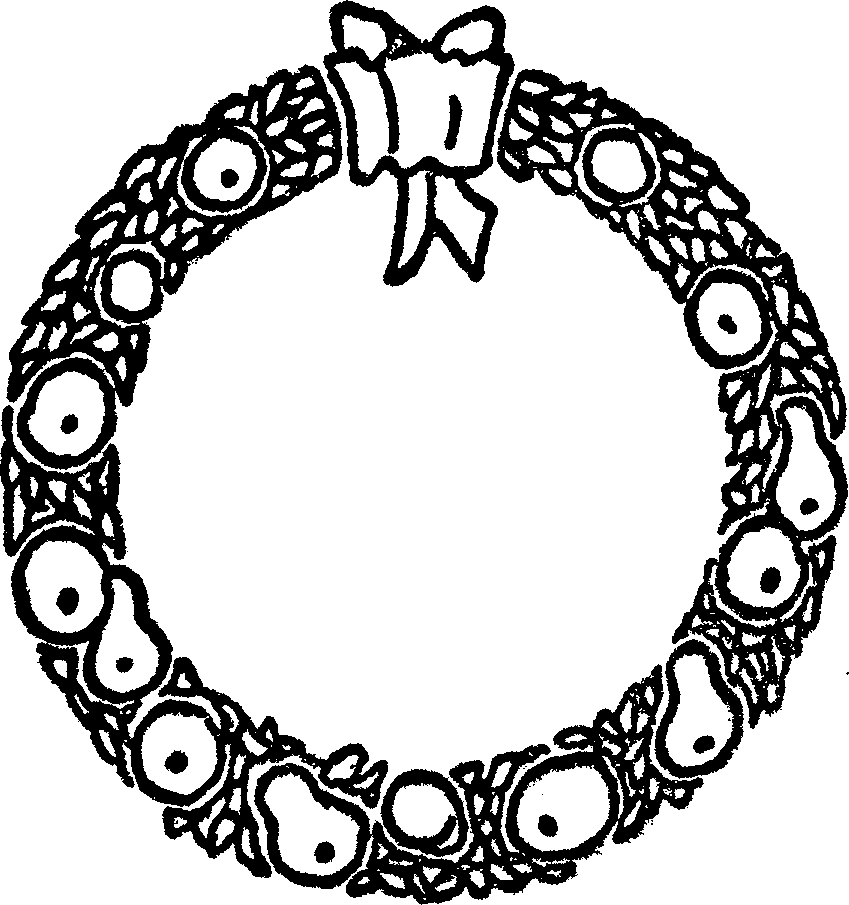
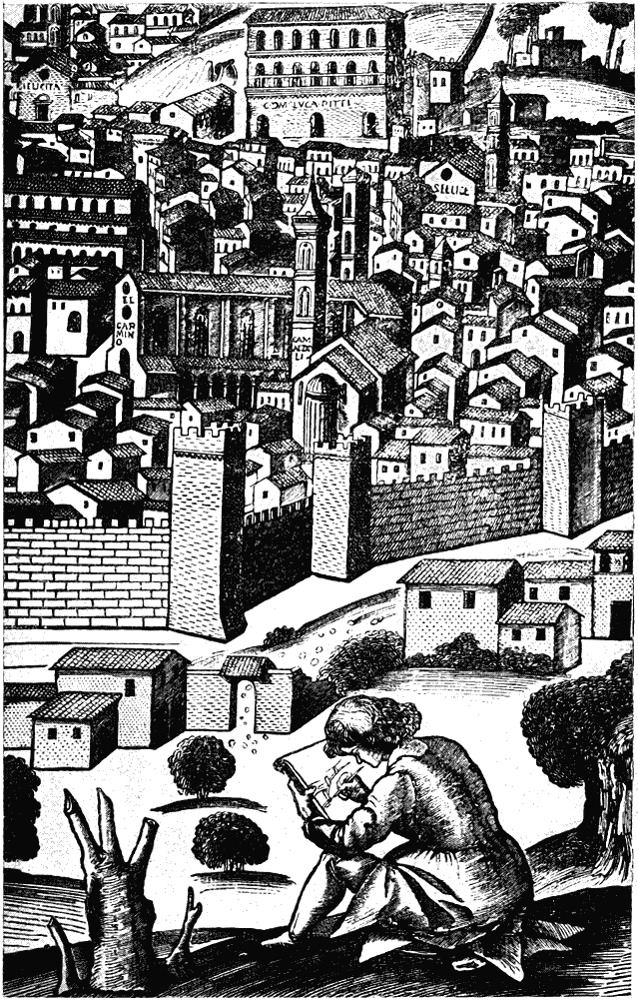
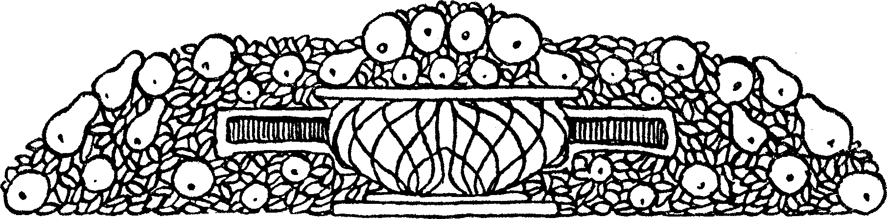
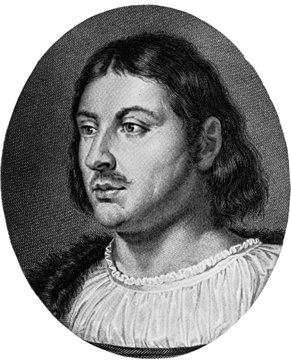
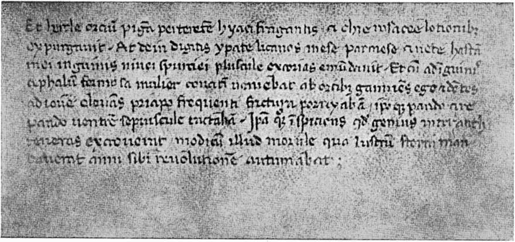
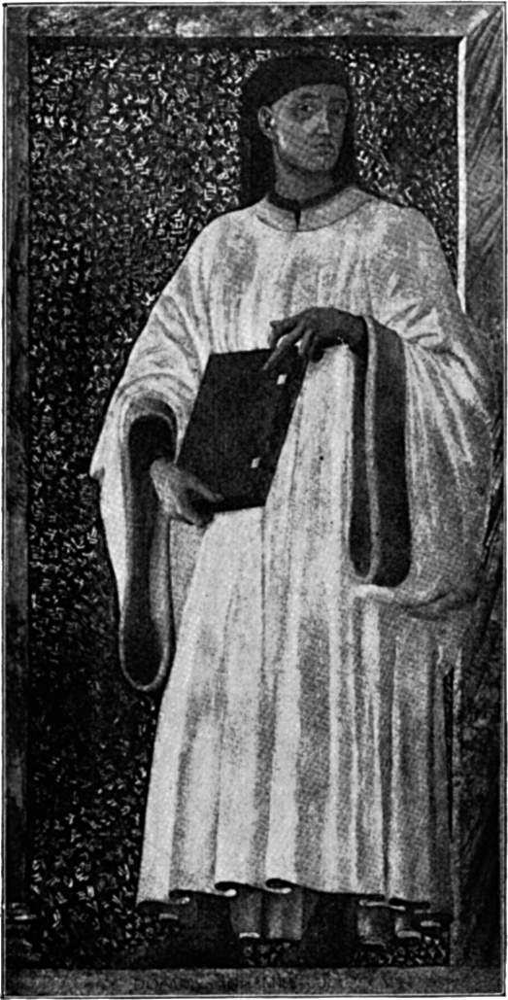
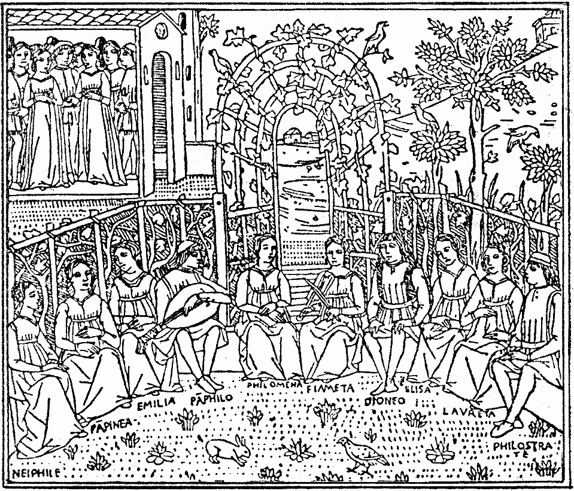
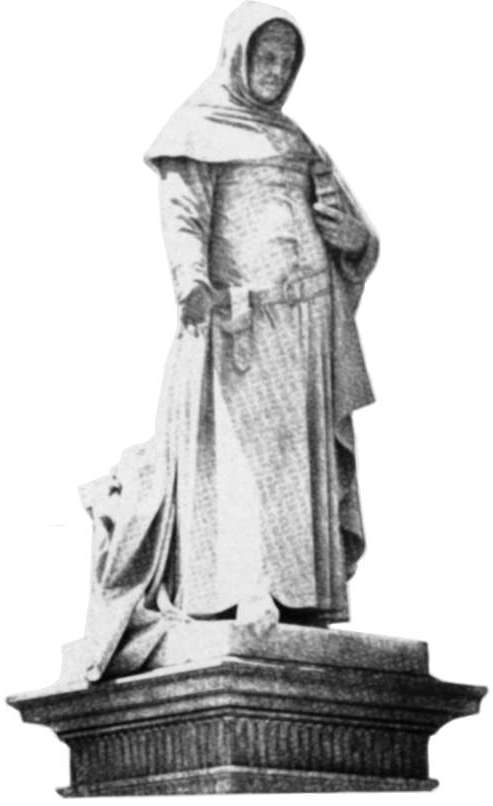

.. -*- encoding: utf-8 -*-

.. meta::
   :PG.Id: 42213
   :PG.Title: Boccaccio
   :PG.Released: 2013-02-26
   :PG.Rights: Public Domain
   :PG.Producer: Jana Srna
   :PG.Producer: Enrico Segre
   :PG.Producer: the Online Distributed Proofreading Team at http://www.pgdp.net
   :DC.Creator: Hesse, Hermann
   :DC.Title: Boccaccio
   :DC.Language: de
   :DC.Created: 1904
   :coverpage: images/cover.jpg

=========
Boccaccio
=========

.. pgheader::

.. style:: document
   :class: language-de

.. role:: gesperrt
   :class: gesperrt

.. role:: small-caps
   :class: small-caps

.. role:: s
   :class: small

.. role:: small
   :class: small

.. role:: large
   :class: large

.. role:: blarge
   :class: bold large

.. role:: larger
   :class: larger

.. role:: blarger
   :class: larger bold

.. role:: x-large
   :class: x-large

.. role:: xx-large
   :class: xx-large

.. role:: xl
   :class: large gesperrt

.. role:: xxl
   :class: x-large gesperrt

.. role:: xxxl
   :class: xx-large gesperrt

.. |nb| unicode:: U+00A0  .. non-breaking space
   :trim:

.. no trim!
.. |n2| unicode:: U+00A0 U+00A0
.. |n3| unicode:: U+00A0 U+00A0 U+00A0
.. |n4| unicode:: U+00A0 U+00A0 U+00A0 U+00A0

.. |-->| replace:: ——>
.. |----| replace:: ————————————————————————————————
.. .. |----| replace:: ──────────────────────────────────── .. U+2500

.. |-| unicode::  U+00A0 U+2014 U+00A0
   :trim:

.. style:: title
   :class: center

.. frontmatter::

.. container:: titlepage

   [pg!1]

   .. class:: right

   | DIE DICHTUNG BD. VII
   | :gesperrt:`BOCCACCIO VON`
   | :gesperrt:`HERMANN HESSE`

   .. vfill::

.. container:: plainpage

    [pg!2]

    .. class:: center
   
    | |----|
    | :xxxl:`DIE DICHTUNG`
    | :blarger:`EINE SAMMLUNG VON MONOGRAPHIEEN`
    | :large:`HERAUSGEGEBEN VON` :xl:`PAUL REMER`
    | :large:`BUCHSCHMUCK VON HEINRICH VOGELER`
    | |----|

    .. class:: center
   
    | Bisher sind erschienen:
   
	| :s:`Band    I.` |n2| Henrik Ibsen  |n3| :s:`von` Paul Ernst
	| :s:`Band   II.` |n2| Anzengruber   |n3| :s:`von` J. J. David
	| :s:`Band  III.` |n2| Victor Hugo   |n3| :s:`von`
						      H. v. Hofmannsthal
	| :s:`Band   IV.` |n2| Liliencron    |n3| :s:`von` Paul Remer
	| :s:`Band    V.` |n2| Leo Tolstoj   |n3| :s:`von` Julius Hart
	| :s:`Band   VI.` |n2| Hölderlin     |n3| :s:`von` Hans Bethge
	| :s:`Band  VII.` |n2| Boccaccio     |n3| :s:`von` Hermann Hesse
	| :s:`Band VIII.` |n2| Cervantes     |n3| :s:`von` Paul Scheerbart
	| :s:`Band   IX.` |n2| Gottfried Keller  :s:`von` Ricarda Huch
   
    .. class:: center
   
    | In Vorbereitung:
   
	| Ebner-Eschenbach |n3| :s:`von` Gabriele Reuter
	| Klaus Groth      |n3| :s:`von` Timm Kröger
	| Kleist           |n3| :s:`von` Wilhelm Hegeler
	| Oscar Wilde      |n3| :s:`von` Hedwig Lachmann
	| Eduard Mörike    |n3| :s:`von` Gustav Kühl
	| Paul Verlaine    |n3| :s:`von` Stefan Zweig
	| Theodor Fontane  |n3| :s:`von` Franz Servaes
	| Lenau            |n3| :s:`von` Leo Greiner
	| Hebbel           |n3| :s:`von` Wilhelm von Scholz
	| Richard Dehmel   |n3| :s:`von` Gustav Kühl
	| Theodor Storm    |n3| :s:`von` Paul Remer
	| Wilhelm Raabe    |n3| :s:`von` Hans Hoffmann

    .. class:: center

    | |----|
    | *Jeder Band elegant kartoniert M. 1.50*
    | *Jeder Band in echt Leder geb. M. 2.50*
    | |----|

.. container:: plainpage

    [pg!3]

    .. class:: center

    | |----|
    | :xxxl:`DIE DICHTUNG`
    | :blarger:`EINE SAMMLUNG VON MONOGRAPHIEEN`
    | :large:`HERAUSGEGEBEN VON` :xl:`PAUL REMER`
    | :large:`BUCHSCHMUCK VON HEINRICH VOGELER`
    | |----|

    .. class:: center

    | In Vorbereitung:

	| Goethe              |n3| :s:`von` Otto Erich Hartleben
	| Shakespeare         |n3| :s:`von` Franz Servaes
	| Heine               |n3| :s:`von` Wilhelm Holzamer
	| Grillparzer         |n3| :s:`von` Wilhelm Hegeler
	| Maeterlinck         |n3| :s:`von` Anselma Heine
	| Schiller            |n3| :s:`von` Fritz Lienhard
	| Richard Wagner      |n3| :s:`von` Hans von Wolzogen
	| Jens Peter Jacobsen |n3| :s:`von` Hans Bethge
	| Ricarda Huch        |n3| :s:`von` Hedwig Bleuler-Waser
	| Swinburne           |n3| :s:`von` John Henry Mackay
	| Eichendorff         |n3| :s:`von` Gustav Falke
	| Turgenjeff          |n3| :s:`von` Carl Hauptmann
	| Alfred de Musset    |n3| :s:`von` Rudolph Lothar
	| \E. T. A. Hoffmann   |n3| :s:`von` Richard Schaukal
	| Franz von Assisi    |n3| :s:`von` Hermann Hesse
	| Gerh. Hauptmann     |n3| :s:`von` Hermann Stehr
	| Conr. Ferd. Meyer   |n3| :s:`von` Wilhelm Holzamer
	| Novalis             |n3| :s:`von` Willy Pastor
	| Wilhelm Busch       |n3| :s:`von` Richard Schaukal

    .. class:: center

    | Die Sammlung wird fortgesetzt.
    |
    | Es sind einhundert Bände vorgesehen.

    .. class:: center

    | |----|
    | *Jeder Band elegant kartoniert M. 1.50*
    | *Jeder Band in echt Leder geb. M. 2.50*
    | |----|

[pg!4]

.. container:: dedication

    .. vfill::

    .. class:: center

     | :large:`FÜR BÜCHERLIEBHABER`
     | WURDEN DIE ERSTEN ZWANZIG
     | EXEMPLARE DIESES BUCHES
     | AUF ECHTES BÜTTENPAPIER
     | GEDRUCKT UND HANDSCHRIFTLICH
     | NUMERIERT. DER PREIS DIESER
     | IN ORIGINAL-COLLIN-LEDER
     | GEBUNDENEN LUXUS-AUSGABE
     | BETRÄGT 10 MARK. SIE IST
     | DURCH ALLE BUCHHANDLUNGEN
     | ZU BEZIEHEN

    .. vfill::

    .. vspace:: 2

    .. class:: center

    | ALLE RECHTE VORBEHALTEN

.. container:: frontispiece

   [pg!5]

   .. image:: images/rahme-o.png
      :width: 100%
      :align: center
      :alt:

   .. class:: center

   | :xx-large:`BOCCACCIO`

   .. class:: center

   | VON

   .. class:: center

   | :x-large:`HERMANN HESSE`

   .. class:: center

   | :small:`ZWEITES TAUSEND`

   .. vfill::

   .. class:: center

   .. image:: images/birnnrad.png
      :width: 50%
      :alt:

   .. vfill::

   .. class:: center

   | VERLEGT BEI SCHUSTER & LOEFFLER
   | BERLIN UND LEIPZIG

   .. image:: images/rahme-u.png
      :width: 100%
      :align: center
      :alt:

..

[pg!6]

.. container:: dedication

   .. vfill::

   .. class:: center large

   | DER SIGNORA MARIA IN
   | ERINNERUNG AN UNSERN
   | SPAZIERGANG IM MUGNONETAL
   | IN VEREHRUNG
   | ZUGEEIGNET!

   .. vfill::

.. container:: verso

    [pg!7]

    .. vfill::

    .. epigraph::

     \... _`conciossiecosachè` le buone _`novelle`
     sempre possan giovare, con attento animo
     son da ricogliere, chi che d'esse sia il
     dicitore.

     .. class:: right

        | :small:`Decamerone, giornata prima.`

.. mainmatter::

[pg!8]

   FLORENZ. Nach einem alten Holzschnitt

[pg 9]

.. toc-entry:: I

|BirnenSchale|
==============

Verehrte Herrschaften und vor allem Ihr,
schöne und angebetete Damen! Es ist üblich,
dass demjenigen, der ein schönes Geschenk
oder Kleinod überbringt, ein guter Dank
und Lohn zuteil wird; und so werdet auch
Ihr, wenn ich Euch einen reichen Schatz
ohne allen Anspruch auf Gewinn oder Lohn
übergebe und anpreise, es freundlich aufnehmen
und mir im stillen Dank dafür wissen.
Dies tue ich aber, indem ich Euch das Buch
meines Freundes Giovanni Boccaccio aus Florenz
in die Hände lege; denn Ihr werdet,
sofern Ihr es verständig leset, in demselben
eine solche Fülle von schönen, klugen, erfreulichen,
rührenden und lächerlichen Geschichten
entdecken, wie sie vielleicht ausserdem
kein anderes Buch irgend eines Dichters
enthält.

Seid Ihr nie an einem schönen, warmen
Tage im Frühsommer an einem fremden
Garten vorüber gegangen? Ihr waret allein
und verdrossen, und aus dem Garten brachte
[pg 10]
der Wind den Geruch von Rosen und Orangeblüten,
das Silbergetön einer plätschernden
Fontäne, die Klänge einer Guitarre und das
von Gelächter unterbrochene Plaudern fröhlicher
junger Leute zu Euch heraus. Da ergriff
Euch Traurigkeit und eine mächtige
Sehnsucht, hinein zu gehen, die staubige
Landstrasse mit grünem Rasen und Blumenbeeten
zu vertauschen, die Lieder der Sänger
und die frohen Gespräche der Glücklichen
anzuhören und Eure Sehnsucht an all der
Heiterkeit und Freude nach Herzenslust zu
ersättigen.

Wohlan, Ihr werten Leute, hier ist das
Tor des Gartens: es ist geöffnet, und aus den
Büschen dringt Blütenduft, Gelächter, Liedergesang
und Saitenspiel. Tretet ein, nehmet
Platz, sättiget Euer Verlangen! Höret Ihr
gerne schöne Lieder an? Oder habt Ihr Lust,
Euch eine traurige Liebesmäre erzählen zu
lassen? Oder freut es Euch, einen Witz,
eine Posse, eine kräftige Anekdote zu vernehmen?
Oder von Beispielen des Edelsinns
und höchster Tugend zu hören? Traget Ihr
Verlangen nach vielfältigen und unerhörten
[pg 11]
Abenteuern, oder mehr nach galanten Historien,
bei welchen die Damen erröten und
sich, der guten Sitte halber, ein wenig entrüstet
stellen?

Ihr alle möget eintreten, und jeder wird
finden, wonach er sich sehnte. Denn die
hundert Geschichten des edlen Herrn Boccaccio
sind so beschaffen, dass sie die Jünglinge
zum Entzücken, die Mädchen zum Erröten
oder zur Rührung, die Männer zum Lachen,
die Weisen zum Nachdenken nötigen. Man
findet in diesen Geschichten die verschiedenen
Arten der menschlichen Natur und Temperamente,
der Liebe und Freundschaft, der
Schicksale in Leben und Sterben, alles auf
eine anmutige und wahrhaftige Art erzählt
und dargestellt. Für Kinder von zartem und
unerfahrenem Alter sind sie nicht geeignet,
auch nicht für blöd gewordene Greise, auch
nicht für Leute von feindseliger, kleinlicher
und mürrischer Sinnesart. Ausser diesen aber
mögen sie von Jungen und Alten jeder Art
mit grossem Vergnügen und gewiss auch
nicht ohne Nutzen gelesen werden.

Ehe ich weiter von diesem merkwürdigen
[pg 12]
Buche mit Euch rede, will ich aber erzählen,
wer eigentlich jener Herr Boccaccio war
(denn er ist leider schon seit längeren Zeiten
verstorben), und wie er das Dekameron geschrieben
hat.

.. vspace:: 3

.. class:: center

|birnenkranz50|

[pg 13]

.. toc-entry:: II

|BirnenSchale|
==============

Wer jemals auch nur die kleinste Novelle
von ihm gelesen hat, der kann nicht daran
zweifeln, dass jener ein echter Florentiner
war. Denn wenn es auch einem Fremden
vielleicht möglich gewesen wäre, die schöne
und glänzende florentinische Sprache so vollkommen
zu erlernen, so würde ihm doch
immer noch der bewegliche, kecke und witzige
Geist des geborenen Florentiners mangeln,
den man nicht lernen kann. Denn wohl
haben in späteren Zeiten auch manche weichliche
Neapolitaner, leichtsinnige Mailänder,
träge Venetianer und plumpe Sienesen hübsche
Novellen geschrieben; allein diese alle hatten
den Boccaccio zum Lehrmeister, welcher der
Vater und Urheber dieser Kunst gewesen ist.

Wenn man nun bedenkt, in welcher Zeit
das Buch Dekameron verfasst wurde, so begreift
man leicht, weshalb die Stadt Florenz
seine Heimat sein musste. Diese reiche und
prächtige Stadt, welche auch heute noch
eine der schönsten auf Erden ist, befand sich
[pg 14]
eben zu jener Zeit zwar in mancherlei Kämpfen
und politischen Nöten, jedoch begann sie
schon sichtbar nach jener unvergleichlichen
Blüte hinzustreben, welche sie hundert Jahre
später erreichte. So erfreute sie sich einer
emsigen und glücklichen Tätigkeit auf allen
Gebieten und nahm nicht weniger im Handel
als in den Künsten täglich an Ruhm und
Glücke zu, während das mächtige Rom kläglich
darnieder lag, indem der Papst samt
seinem ganzen Hofhalte sich nach Avignon
in der Provence verzogen hatte. Es war von
Florenz sowohl der berühmte Petrarca als
der grosse Dichter Dante gebürtig, obwohl
dieser in der Verbannung gestorben war,
wie denn auch infolge beständiger Bürgerkriege
des Petrarca Familie vertrieben war
und in Arezzo lebte. Und was die Florentiner
an jenem göttlichen Dichter gesündigt hatten,
suchten sie desto eifriger zu sühnen, indem
sie damals und noch lange nachher eine
grosse Zahl von Gelehrten, Dichtern, Künstlern
und anderen Männern beherbergten, deren
Ruhm ihrer Stadt zur Ehre gereichte und
sie gewürdigt hat, bis auf diesen Tag die
[pg 15]
eigentliche Geburtsstätte des rinascimento
zu heissen. Zugleich unterhielten die Kaufleute
einen grossen Verkehr nach allen Ländern
der Welt, und es lebten viele Florentiner
Bürger als Händler und Geldwechsler in
Rom, Neapel, Mailand, Paris, Byzanz, London,
Flandern, auf Sizilien, Malta, Kreta, Cypern
und anderwärts, von wo nicht nur Geld
und Wohlstand, sondern auch mannigfaltige
Nachricht und Kunde fremder Gegenden,
Sitten und Begebenheiten täglich in die Stadt
kamen.

Aus einer so beschaffenen Zeit und Stadt
entstammte also der Verfasser des Dekameron.
Aber dennoch ist er nicht in Florenz oder
in dem benachbarten Certaldo, von wo sein
Geschlecht herkam, geboren. Vielmehr fügte
es das Schicksal, das ja stets der grösste
Dichter gewesen ist, dass das Leben dieses
weitbekannten Novellenerzählers in einiger
Dunkelheit und nicht anders als eine Abenteuernovelle
begann.

Höret denn, Ihr lieben Herren und Damen,
das Wenige, was man vom Leben dieses
herrlichen Dichters heute noch weiss, denn
[pg 16]
leider ist es lange nicht so viel, als man
wünschen möchte!

Aus dem Städtchen Certaldo im Elsatal
gebürtig, lebte zu Florenz ein Kaufmann
namens Boccaccio. Er war ein fleissiger und
kluger, allein auch geldgieriger und leichtfertiger
Mensch, welcher zahlreiche Handelsreisen
teils für fremde, teils für eigene Rechnung
unternahm, wobei er ebenso sehr für
seinen Vorteil wie für sein Vergnügen zu
sorgen verstand, jedoch nach Art der Kaufleute
auch öfteren Zufällen und Glückswechseln
ausgesetzt war. Längere Zeit war er an dem
grossen Bankgeschäfte des altberühmten
Hauses der Bardi beteiligt, welches auch in
Paris, wie in anderen Städten, eine Filiale
besass und hohes Ansehen genoss. Diesem
Pariser Hause hat unser Kaufmann eine Zeitlang
vorgestanden, und wenn er dabei sich
als einen tüchtigen Handelsmann erwies, so
liess er doch in dieser grossen und üppigen
Hauptstadt auch sein Vergnügen nicht ausser
Augen.

   Jugendbildnis BOCCACCIOS

Wenigstens sah er daselbst eines Tages
eine junge und sehr hübsche Witwe, welche
[pg 17]
ihm überaus wohlgefiel und deren Gunst er
sogleich zu erwerben sich bemühte. Dies
tat er denn auch, als ein gewiegter Mann,
auf jede Weise, indem er sich für einen Edelmann
ausgab, was ihm bei seiner hübschen
Gestalt sehr wohl gelang. Er spielte den
Feinen und trat nicht anders auf, als wenn
er der Sohn des vornehmsten Hauses gewesen
wäre, obwohl er im Grunde wenig mehr als
ein bäuerisch gebildeter Geldwechsler war.
Bald hatte er die Augen der schönen Witwe
auf sich gelenkt und sie seinen ehrerbietigen
Bitten zugänglich gemacht, und da er ihr
mit vielen Schwüren die Ehe versprach, sah
er sich in kurzem am äussersten Ziel seiner
Wünsche angelangt. Zu beiderseitigem Vergnügen
erfreuten sie sich längere Zeit ihrer
Liebe ohne Hindernisse, und gewiss hätte
der Florentiner noch lange nicht an die Rückkehr
nach seiner Heimat gedacht, wäre nicht
infolge dieser Liebschaft jene Witwe nach
Jahresfrist mit einem hübschen Knäblein
niedergekommen. Dieses passte keineswegs
in die Pläne des leichtsinnigen Italieners, und
da die Dame ausser ihrer Schönheit keine
[pg 18]
Reichtümer besass, verliess er, ohne sich
seiner Schwüre mehr zu erinnern, sie und
die Stadt Paris in aller Stille und begab sich
als ein lediger Mann nach Florenz zurück,
wie es stets die Art solcher Leute war, sich
um eine leere Flasche und um eine schwanger
gewordene Geliebte mit keinem Blicke mehr
zu bekümmern.

Das Knäblein aber, das die arme Frau im
Jahre 1313 gebar, war Giovanni Boccaccio.

Von Schmerz und Sorge entkräftet, lebte
die unglückliche Dame nur noch wenige
Jahre, und nach ihrem Tode ward Giovanni
in zartem Knabenalter nach Florenz zu seinem
Vater gebracht. Dort besuchte er eine gute
Schule, erwarb sich einige Kenntnis der
lateinischen Sprache und wäre am liebsten
bei den Büchern sitzen geblieben, um sich
ganz den Studien hinzugeben. Aber kaum
war er etwa dreizehn Jahr alt, so nahm ihn
der Vater zu sich, lehrte ihn die notwendigsten
Handgriffe und Rechenkünste der Handelsleute
und übergab ihn sodann einem Geldwechsler,
damit er bei diesem die Kaufmannschaft
erlernen sollte. Sechs Jahre blieb er
[pg 19]
denn bei diesem Gewerbe, ohne jedoch etwas
Erkleckliches zu lernen oder gar den Handel
lieb zu gewinnen. Vielmehr lief er überall
hin, wo er Verse singen oder vortragen hören
konnte, und lernte viele Stücke aus den
grossen Gedichten des Dante und des Virgil
auswendig, welche ihn höchlich begeisterten
und mit einer unauslöschlichen Liebe zur
Poesie erfüllten.

Am Ende dieser sechs Jahre sah jedermann
deutlich, dass Giovanni in die Handelschaft
passte wie der Fisch aufs Trockene.
Dies sah auch der Vater wohl ein und beschloss
daher, seinen Sohn den Studien an
Universitäten zu widmen, und zwar wählte
er für ihn das Studium des kanonischen
Rechts, indem es ihm als einem klugen
Manne schien, es sei mit diesem Handwerk
nicht wenig Geld zu verdienen, wenn einer
es ordentlich verstehe. Weil aber Giovanni
um diese Zeit sich eben in Neapel befand,
schien es dem Vater am wohlfeilsten, dass
er dort seine Studien abmache, ohne dass
er geahnt hätte, welcherlei Kenntnisse derselbe
sich dort erwerben würde.

[pg 20]
Es war nämlich Neapel zu jener Zeit gewiss
die allerüppigste Stadt in ganz Italien,
zumal da gerade unter dem Könige Robert
die Einwohner eines längeren Friedens genossen,
woran sie nur schlecht gewöhnt waren.
Von dem Leben bei Hofe brauche ich wenig zu
sagen, indem jedermann die Namen der sechs
Neffen des Königs, sowie seiner Schwägerin,
der sogenannten Kaiserin von Konstantinopel,
und seiner Enkeltochter Johanna kennt, welche
sämtlich durch alle Welt einen bösen Leumund
hatten. Vorab jene Johanna führte
ein überaus freches und tadelnswertes Leben,
hatte ihres Gatten Bruder zum Buhlen und
nahm ihn später, nachdem sie sich des andern
durch Mord entledigt hatte, ohne päpstlichen
Dispens zum Gemahl. Auch sonst war in
der Stadt, zumal unter den Edelleuten, ein
vergnügliches Schlemmen, auch Hader und
kleinere Mordtaten im Schwang, und bei
Hofe war längst zwischen echten Kindern
und Bastarden weder von den Vätern, noch
von anderen mehr zu unterscheiden. An
diesem Hofe, wo er noch zu Lebzeiten des
Königs von seinem jungen Landsmanne
[pg 21]
Niccolo Acciajuoli eingeführt wurde, ging
nun das Studentlein ab und zu. Daselbst
war mit Festen, Mahlzeiten, Ball, Tanz und
Maskenscherzen ein verschwenderisches Leben,
und gewiss hat Boccaccio niemals irgend
eine üppige oder lüsterne Geschichte erzählt,
welche er nicht in Neapel viel toller und
gründlicher selbst mitangesehen hatte.
Dass er auf dem Gebiete der gelehrten
Studien (das Latein ausgenommen) etwas
Erhebliches geleistet oder den Grad eines
Doctoris juris canonici erlangt hätte, wird
nirgends berichtet. Statt dessen legte er
damals den Grund zu seiner tiefen Kenntnis
der menschlichen Leidenschaften, da er von
hervorragenden Beispielen der Verschwendung
und Habgier, des Aberglaubens, der
Wollust, der Gefrässigkeit, Mordgier, Verschlagenheit
und Eitelkeit rings umgeben
war. Am gründlichsten jedoch unterzog er
sich dem Studium der Liebe, deren Leiden
und Freuden er bis zur Neige an sich selber
erfuhr.

Eines Tages nämlich, um die Zeit der
Ostern, vermutlich im Jahre 1334, erblickte er
[pg 22]
in einer Kirche zu Neapel die Dame, welche
sein Herz zu Lust und Pein von da an jahrelang
gefangen hielt. Diese war Donna Maria, die
natürliche Tochter des Königs Robert, welche
für eine Tochter des Grafen von Aquino galt
und mit einem angesehenen Edelmann vermählt
war. Die schöne und vornehme Dame
betrachtete bald auch von ihrer Seite den
hübschen jungen Florentiner mit Teilnahme
und ist eine lange Zeit, nicht ohne Gewissensbisse
und Furcht vor ihrem Eheherrn, seine
Geliebte gewesen. So genoss, wie in der
schönsten Abenteuernovelle, der Bastard eines
kleinen Kaufmanns die Tochter eines grossen
Königs.

Über alledem liess Boccaccio das kanonische
Recht unbehelligt in den Pergamentrollen
schlummern und vom Lehrstuhl ertönen.
Er trieb nach seiner Neigung Latein
und Astrologie, im übrigen wandte er sich
der heiteren Seite des Lebens zu und ward
nach Kräften seiner Jugend froh. Er verfasste
in diesen Jahren, zumeist für seine
Geliebte, eine unglaubliche Menge von Gedichten
und mehrere Romane, von welchen
[pg 23]
heute niemand mehr redet. In diesen legte
er seiner Dame den Namen Fiammetta bei,
und noch manche Jahre später hat er in
wehmütiger Liebeserinnerung diesen Namen
einer von den Damen des Dekameron gegeben.
Ohne Zweifel ist jene Zeit die heiterste
und glücklichste in seinem Leben gewesen.
Allein wie wir sehen, dass auch den goldensten
Tagen zu früh die Sonne sinkt, so nahm
auch diese Lust zu ihrer Zeit ein Ende.

Im Jahre 1341 befahl der Vater seinem
Sohne, nach Florenz zurückzukehren, und
nach längerem Zögern machte dieser sich
unmutig auf den Heimweg. Der Alte, für
den Giovanni ohnehin keine allzu starke Zärtlichkeit
empfand, hatte inzwischen auch noch
eine gewisse Monna Bice Bostichi geheiratet,
worüber der heimkehrende Sohn nicht eben
erfreut war. Es geschahen jedoch weit
schlimmere und wichtigere Dinge, über
welchen er diese kleineren Sorgen vergass.
Es war die Zeit, in welcher der in Florenz
so übel beleumdete Herr Gautier von Brienne,
genannt Herzog von Athen, sich für eine
kurze Zeit zum Tyrannen der Stadt emporschwang.
[pg 24]
Dieser war ein frecher Abenteurer
und hatte im Solde der Republik gegen Pisa
gedient, warf sich nun aber mit Hilfe des
niedrigsten Pöbels zum Herrscher auf und
schlürfte die Monate seiner Herrlichkeit zügellos
wie ein Trunkener den letzten Becher.
Die Stadt und das ganze Staatswesen drohten
in Trümmer zu gehen.

Boccaccio, ein unbestechlicher Republikaner,
hat das Schicksal des Herzogs von
Athen, der mit Schimpf von der Bürgerschaft
vertrieben wurde, in einer Abhandlung
beschrieben. Nun schienen ihm allmählich
die Zustände in Florenz und im väterlichen
Hause so wenig erträglich, dass er
schon im Jahre 1344 von neuem nach Neapel
ging. Die Rechtsgelehrtheit hatte er schon
früher aufgegeben. Und so genau er auch
im Dekameron die Pest in Florenz geschildert
hat, ist er zurzeit derselben doch nicht
daselbst gewesen, sondern in Neapel, wo freilich
der schwarze Tod nicht weniger grauenhaft
wütete. Es starb damals auch seine Geliebte
Maria, und er widmete ihrem Tode zwar
einige trauernde Verse, jedoch war seine
[pg 25]
ursprünglich so heftige Leidenschaft mit den
Jahren erloschen. Es scheint ausserdem, als
habe Donna Maria ihn schon früher wieder
fahren lassen, obwohl er in seiner Erzählung
„Fiammetta“ das Gegenteil darstellt. Nicht
lange darauf starb auch sein Vater, und er
musste wieder nach Florenz zurückkehren.

Von da an erblicken wir sein Bild verändert;
sein Leben verlief ohne heftige Erschütterungen,
und er alterte als ein tüchtiger
und angesehener Bürger. Im Alter von ungefähr
40 Jahren schrieb er sein unsterbliches
Dekameron, und man könnte glauben,
er habe alle seine Schalkhaftigkeit und fröhlich
lachende Untugend darin liegen lassen.
Nur noch einmal widerfuhr ihm eine bittere
Liebesgeschichte. Er verliebte sich heftig
in eine vornehme Witwe, welche ihm aber
einen bösen Possen spielte. Nämlich sie
stellte sich, als wäre sie geneigt, die Wünsche
des Dichters zu erfüllen, und benutzte alsdann
die erste Gelegenheit, ihm eine Nase
zu drehen und ihn unter dem Hohngelächter
all ihrer Bekannten und Freunde kläglich heimzuschicken.
Das war Boccaccios letzte Liebe.

[pg 26]
Im übrigen, da der Vater ihm eine kleine
Erbschaft hinterlassen hatte, lebte er als ein
stillgewordener Mann und widmete sich allerlei
gelehrten Studien. Den Griechen Leontius
Pilatus hatte er, um seine Sprache zu lernen,
über zwei Jahre lang bei sich im Hause.
Öfters übernahm er im Dienste der Stadt
politische Aufträge und Ambassaden, unter
anderem besuchte er dreimal als Gesandter
den Papsthof zu Avignon. Mit grossem Eifer
forschte er dem Leben und den Schriften
des Dante nach, den er ungemein verehrte.
Mit dem etwas älteren Petrarca, welcher damals
von sich selber und von jedermann für
den grössten lebenden Dichter gehalten
wurde, pflegte er eine edle und herzliche
Freundschaft und war untröstlich, als dieser
im Jahre 1374 starb.

Aber das Leben dieses merkwürdigen
Mannes, dessen Anfang ein Abenteuer und
dessen erste Hälfte ein Hymnus der Liebe zu
sein scheinen, verwandelte sich zum Schlusse
noch in eine fromme Posse. Noch als ein
rüstiger Mann hatte er das Dekameron geschrieben,
welches bald auf schalkhafte, bald
[pg 27]
auf leidenschaftliche Art dem Dienste schöner
Frauen huldigt und über Mönche und Priester
unerschöpflichen Hohn ergiesst. Nicht gar
viel später aber gelang es einem schwindelhaften
Mönche, namens Ciani, ihn zu bekehren,
und zwar vermittelst einer nicht einmal
sehr durchtriebenen Bauernfängerei, und
von da an hörte man ihn seine schönsten
Werke nie anders denn als verwerfliche
Jugendsünden und Verirrungen bezeichnen.
Noch viel schlimmer aber und lächerlicher
ist es, dass der vormalige Schalk und Weiberfreund
in seinen älteren Tagen zu einem argen
Frauenverächter ward und ein Buch mit dem
Titel Corbaccio geschrieben hat, in welchem
man, wenn man Lust hat, hunderte von schimpflichen,
grausamen, hasserfüllten und anklagenden
Reden über die Weiber finden kann |-|
dazu in einer Redeweise, welche an Unflätigkeit
auch die kühnsten Stellen seiner früheren
Werke zehnmal übertrifft. Das sollte seine
Rache an jener grausamen Witwe sein; allein
der Dichter tat damit, wie wir es oft sich ereignen
sehen, nur einen Schnitt ins eigene
Fleisch.

[pg 28]
Eine späte Ehre ward ihm zuteil, indem
er nach mannigfachen Studien und Reisen
im Jahre 1373 zum öffentlichen Ausleger der
göttlichen Komödie des Dante zu Florenz
ernannt wurde, wofür er jährlich hundert
Goldgulden bezog. Diese Vorlesungen hielt
er unter grossem Zulaufe in der Kirche Santo
Stefano bis kurz vor seinem Tode. Er starb
am 21. Dezember 1375, zweiundsechzig Jahre
alt, und wurde ehrenvoll bestattet. Die Liebe
zu der grossen Dichtung des Dante verlieh
seinen späteren Tagen, trotz des bösen Corbaccio,
noch eine gewisse ehrwürdige Glorie.
Für die nachfolgenden Jahrhunderte aber ist er
wieder der Geschichtenerzähler mit der Schelmenmiene
geworden, und dem heutigen Geschlecht
ist an einem einzigen Witz aus einer
seiner Novellen mehr gelegen als an der
ganzen Gelehrsamkeit und Ehrbarkeit seines
ehrenvollen Alters.

.. class:: center

|birnenkranz20|

[pg 29]

.. toc-entry:: III

|BirnenSchale|
==============

Über die Dichtergrösse des Boccaccio,
welchen man gerne den dritten unter den
grossen italienischen Poeten nennt, steht in
vielen Büchern viel geschrieben, was alles zu
wiederholen nicht vonnöten ist. Er war
unter denen, welche jemals kunstgerechte
Novellen verfasst haben, nicht nur der Erste,
sondern indem er diese scheinbar geringe
Kunst früher als irgend ein anderer betrieben,
ja eigentlich erfunden hat, übte er sie sogleich
mit einer solchen Vollendung aus, dass er von
keinem seiner unzähligen Nachfolger übertroffen
oder auch nur erreicht werden konnte.
Nicht weniger gross ist aber sein Verdienst
um die italienische Sprache, welche er nicht
etwa nur verschönert und ausgeschmückt,
sondern in gewissem Sinne eigentlich neu
geschaffen hat. Denn obwohl schon lange
vor ihm der Florentiner Dante das grösste
und schönste italienische Gedicht verfasst hat,
war doch das Gebiet der Erzählung und die
Prosasprache überhaupt noch von keinem mit
[pg 30]
einiger Kunst gepflegt worden, indem die
Gelehrten häufig lateinisch geschrieben hatten.
Die mündliche Sprache des Volks, welche in
Florenz mit besonderer Schönheit und Reinheit
gebraucht wird, hat Boccaccio als der
Erste in seinen Erzählungen mit ihrer natürlichen
Anmut und Mannigfaltigkeit verwendet
und zugleich mit so grosser Kunst gepflegt,
dass sie in seinen Händen sich in etwas ganz
neues und herrliches verwandelte.

In den Büchern des Dekameron zu lesen,
ist für einen, welcher seine Lust an einer
schönen und lebendigen Sprache hat, nicht
anders als ein Wandeln unter blühenden
Bäumen und als ein Baden in einem reinen
Gewässer. Die Worte klingen so frisch, als
wären sie soeben erschaffen und vorher noch
in keinem Munde gewesen; in jedem kleinen
Satze springen klare, lachende Quellen auf,
und die Sätze tanzen bald leicht und zierlich,
bald rollen sie tönend und wohllaut hin.
Vielen will es scheinen, es habe Boccaccio
zuweilen seiner Sprache Gewalt angetan, und
es mag ein wenig Wahrheit daran sein.
Während er die Worte aus der Sprache des
[pg 31]
Volkes von Gassen und Märkten nahm, bildete
er hinwieder den Bau seiner Perioden
vornehmlich nach dem Muster der römischen
Redner und Autoren, zumal des Cicero, den
er ungemein verehrte.

Dadurch mag vielen, auch wenn sie der
heutigen italienischen Sprache mächtig sind,
das Lesen des Dekameron ein schweres und
mühsames Werk erscheinen. Allein es ist
nicht nur der Anfang dieses Buches der
langen Perioden wegen schwieriger zu lesen
als die Folge, sondern es pflegen ohnehin
nach einigen Versuchen die meisten an dieser
Sprache ein solches Gefallen zu finden, dass
sie schnell einige Übung darin erlangen. Und
vornehmlich darf derjenige, welchem etwa
das Lesen des Dante zu schwerster Mühsal
gereichte, so dass er ermüdet davon abliess,
durchaus nicht fürchten, hier auf dieselben
Schwierigkeiten zu stossen. Kurzum, wer
einigermassen italienisch versteht, möge sich
nicht scheuen, das Dekameron im originalen
Texte zu lesen. [*]_ Sobald er nur einige Übung
[pg 32]
erlangt hat, wird ihm über den Seiten dieses
Buches sein, als höre er Vögel zwitschern,
Kinder lachen und Wasser rauschen, eine
solche innere Kraft und freudige Lebensfülle
ist in dieser Sprache verborgen.

.. [*] Wodurch aber niemand von der Lektüre einer Übersetzung
   abgeschreckt werden soll! Vor den zahlreichen verkürzten
   und verstümmelten Ausgaben aber sei dringend gewarnt!
   Das Dekameron muss notwendig unverkürzt gelesen
   werden. Zur Zeit ist die einzige vollständige, übrigens ganz
   vortreffliche deutsche Übersetzung die von Schaum, deren
   neue Ausgabe in drei Bänden 1903 im Insel-Verlag in
   Leipzig erschienen ist.

Was das Dekameron als Dichtung anbelangt,
so ist es überaus merkwürdig zu
sehen, wie alle Kräfte und Vorzüge des
Dichters, welcher ja auch eine nicht geringe
Zahl von anderen Werken geschrieben hat,
in diesem einen Hauptwerke sich schön und
harmonisch vereinigen. Die früheren, allmeist
in Neapel entstandenen Dichtungen des
Meisters handeln fast ohne eine einzige Ausnahme
von der Liebe, und die Erzählung
„Fiammetta“ ist bei weitem die schönste
unter ihnen. Jedoch weiss in allen diesen
Dichtungen Boccaccio nichts anderes darzustellen
als seine eigenen Gefühle und Liebesgedanken,
[pg 33]
ohne genügende Mannigfaltigkeit,
und die Verse, soweit es sich um solche
handelt, sind mit grossem Fleisse, aber geringer
Erfindungskraft dem Muster des Petrarca
nachgeformt, wie denn stets die jungen Poeten
solche Berühmtere nachzuahmen bestrebt
waren. Von diesen Dichtungen erwecken
mehrere eine Ahnung von seinem späteren
Werke, als habe die Idee desselben ihm
schon längere Jahre am Herzen gelegen.

   BOCCACCIOS Handschrift

Aber wie ein frischer und tüchtiger Mann
erst in den Jahren der völligen Reife die
schwere Kunst des Lebens lernt, die darin
besteht, dass der einzelne Mensch seine Schicksale
und Gefühle gleich der Welle im Meer
ansehen und mit heiterer Bescheidenheit im
grösseren Leben der Gesamtheit verbergen
kann, so besann sich auch dieser Boccaccio
erst in späteren Jahren, als schon die Leidenschaft
seiner Jugendzeit verglommen war, auf
alle seine Kräfte. Was er von Kind auf, aus
seiner Bastardkindschaft her, und alsdann in
Florenz und Neapel und auf manchen Reisen
erfahren hatte, wurde nun zu plötzlicher Klarheit
erhoben und im stillen entbunden. Nicht
[pg 34]
weniger die Leiden und die Wollust der
Frauenliebe als der Zauber des Reisens und
Schauens, die Erlebnisse und Sitten der Studenten
ebenso wie die Sorgen und Plagen
der Kaufleute, die Gebräuche, Tugenden und
Laster derer, die bei Hofe und die in der
Wechselbank und die auf den Märkten oder
zu Schiffe leben und ihr Brot zu erwerben
suchen, die Eigenschaften der Narren wie
der Weisen, die Lebensart der Priester, der
Richter, der Soldaten, der Seefahrer, der
Frauen, der Dirnen sowie alles Ernste, Schöne,
Seltsame, Lächerliche und Traurige des
menschlichen Lebens, soweit nur jemals ein
Mensch es erfahren und beobachtet hat |-|
dieses alles zog er nun aus seinem Gedächtnisse
hervor.

Gewisslich sind von den hundert Erzählungen
des Buches Dekameron nur sehr
wenige von Boccaccio selbst erfunden worden.
Vielmehr hatte er die einen erzählen hören,
die anderen selbst erlebt oder sich zutragen
sehen, andere auch aus alten Sagen und
Liedern und Fabeln genommen. Nur ein Tor
möchte wünschen, er hätte sie alle selbst sich
[pg 35]
ausgedacht. Im Gegenteil ist es einer der
grössten Vorzüge des Dekameron, dass es
gleich einem Speicher oder Juwelenschrank
die Erfahrungen und Schicksale unzähliger
Menschen und Zeiten in sich beschlossen hält.
Viele von den Geschichten kamen aus dem
Morgenlande, aus Griechenland und aus Frankreich,
Spanien und Germanien her, viele sind
schon sehr alt gewesen, andere wieder erst
von gestern. Dass aber ein einzelner Mann
diese zahllosen kleinen Stücke in seinem Gedächtnis
gesammelt, alsdann geordnet und
verbessert und am Ende zu einem grossen,
wundervollen Ganzen zusammengesetzt hat,
dazu in einer von ihm selbst geschaffenen,
vollkommenen Sprache |-| und das Ganze so
ebenmässig, rein und klar und in sich selber
einig, als wäre alles am selben Tag und aus
demselben Geist entstanden |-| dieses ist, so
oft man es auch betrachte, ein fast unbegreifliches
Wunder. Begebenheiten und
Lehren, Spässe und weise Erfahrungen, die
eine uralt, die andere frisch von der Gasse,
die eine von Hofe, die andre aus dem Bettelvolk,
die eine arabischen, die andre deutschen,
[pg 36]
die dritte französischen Ursprungs, lustige
und klägliche, edle und gemeine, diese alle
zusammen zu einem einzigen prächtigen Werk
vereinigt, aneinander gefügt und wie die Steine
eines Geschmeides jede die Nachbarin hebend
und verzierend, und dennoch jede einzelne
bis in die geringsten Teile mit aller Kunst
und Sorgfalt ausgebaut und zur Vollkommenheit
gebracht! Wahrlich, wenn Boccaccio in
seinem Leben eine grosse Torheit und Sünde
begangen hat, so war es, als er sein unsterbliches
Werk selber als eine müssige und
leichtfertige Jugendarbeit und Verirrung verleumdete.

Allerdings genoss er zu seinen Lebzeiten
den meisten Ruhm nicht um der Novellen,
sondern um seiner gelehrten Werke willen,
von welchen heute nur noch die Vita di Dante
einigen Wert hat. Dennoch zählte er zu den
unterrichtetsten Männern seiner Zeit, und indem
er einen schönen lateinischen Stil schrieb,
sich sehr um die alten Autoren bemühte und
auch die damals nur wenig gepflegte Kenntnis
des Griechischen auszubreiten bestrebt war,
hat er ebenso wie Petrarca einen ruhmvollen
[pg 37]
Anteil an der Begründung des italienischen
rinascimento.

Von der Beschaffenheit, Einrichtung und
Konstruktion des Dekameron will ich später
sprechen. Über das Schicksal desselben ist
wenig zu sagen, als dass es |-| unendlichen
Anklagen und Verleumdungen zum Trotze |-| schon
nach kurzer Zeit über mehrere
Länder verbreitet war, auch seither in vielen
Übersetzungen und hunderten von Ausgaben
immer wieder gedruckt worden ist. Unglücklicherweise
ist keine Handschrift der Novellen
von der eigenen Hand des Boccaccio erhalten
geblieben, und lange Zeit wurde mit dem
Texte so nach Willkür umgesprungen, dass
es erst später fleissigen Gelehrten gelang,
ihn so ziemlich wieder auf den status quo ante
zu bringen.

Das Dekameron hat häufige Wiedergeburten
im Geiste anderer grosser Dichter
und Künstler gefeiert. Gleichwie in dem
Schauspiel „Nathan der Weise“ die dritte
Novelle, von den drei Ringen, eine neue Gestalt
annahm und wieder Tausende erfreute,
so haben früher und später viele andere, vor
[pg 38]
allem Shakespeare, aus dem Schatze des
Florentiners geschöpft, dessen Spuren in zahlreichen
Dichtungen aller Völker zu finden
sind. Nicht weniger haben die Zeichner und
Maler sich an ihm vergnügt und viele seiner
Novellen in Bildern dargestellt; und noch im
Jahre 1849 hat der britische Malermeister
Millais aus der Novelle vom Basilikumtopf
(Tag 4, Novelle 5) eine Szene in einem berühmten
Gemälde abgebildet.

Der vielen anstössigen Stellen wegen hat
man _`schon früher des öfteren` sogenannte verbesserte
und purgierte Ausgaben veranstaltet.
Was in solchen Fällen, zumeist von
geistlichen Herren, am Text verballhornt und
geschändet worden ist, lässt sich leicht denken.
Dabei kümmerte man sich übrigens wenig
um die derben und heiklen Stellen, sondern
vor allem um jene, in welchen Boccaccio der
Geistlichkeit unliebsame Wahrheiten gesagt
hat. Einmal, ums Jahr 1570, wurden zu Florenz
vier Herren ernannt zu der Aufgabe, das
Dekameron endgültig von allen gegen die
Satzungen der Kirche verstossenden Stellen
zu säubern. Da wurden, wo immer es nötig
[pg 39]
schien, aus den Mönchen Bürger und Ritter,
aus den Nonnen Edeldamen gemacht, zwei
von den Novellen wurden zu einem mysteriösen
Unsinn verbessert, und als nach langer Mühe
die Ausgabe vollendet war, zeigte es sich,
dass den Herren eine der heitersten Geschichten
durch die Finger geschlüpft war,
und jenes Dekameron hatte statt hundert nur
neunundneunzig Novellen. Ausserdem ist das
Buch häufige Male „für die Jugend“ ediert
worden und wird es in Italien „per giovani
modesti“ heute noch.

Besonders schlimm erging es ihm mehr
als hundert Jahre nach seines Verfassers Tod,
zur Zeit des wohlbekannten oder übelbekannten
Savonarola. Dieser wütende und vermutlich
geisteskranke Mönch, welcher nach Kräften
dazu beitrug, Florenz und Italien dem Untergang
näher zu bringen, hat ausser einer Menge
von anderen schönen Dingen auch sehr viele
Exemplare des Dekameron öffentlich verbrennen
lassen.

Wo jedoch eine kräftige Quelle aus der
Erde gebrochen ist, hat das Verbauen und
das Exorzieren niemals viel geholfen, und es
[pg 40]
ist schwerer, etwas geistig Lebendiges zu ertöten,
als etwas Totes wieder zum Leben zu
bringen. So hat denn auch Boccaccio manche
Zeitgenossen und Nachfolger gehabt, deren
erloschenen Ruhm die Gelehrten mit unsäglichen
Mühen bis auf heute herüber geschleppt
haben, indessen er selber inmitten
aller Keulenschläge am Leben blieb und heute
noch den gleichen Glanz und Zauber hat wie
seinerzeit.

Indem ich dieses schreibe, träumt mir
von einem Cypressenbaum am Hügelabhang
zwischen Vincigliata und Settignano, wo ich
vor Zeiten zum erstenmal, im Grase liegend,
das köstliche Buch genoss. Es lief ein lauer
Wind talab, mit Blütenduft von Limonen und
Mandeln beladen, es lag ein süsses Licht
über Florenz und allen Bergen, und es sang
aus einem fernen Garten eine welsche Laute
herüber, allein ich sah es nicht und hörte es
nicht; ein süsserer Duft und ein viel köstlicherer
Klang stieg mir aus den gelben
Blättern des alten Buches zu Häupten.

.. footnotes::
   :local:
   :class: small

[pg 41]

.. toc-entry:: IV

|BirnenSchale|
==============

Das Buch Dekameron ist auf eine solche
Art eingerichtet, dass seine hundert Novellen
an zehn Tagen von zehn jungen und edlen
Leuten erzählt werden, und darunter sind
sieben Mädchen und drei Jünglinge. Auf
diese Weise kommt daher jede Novelle nicht
aus unbestimmter Ferne, sondern frisch aus
dem Munde eines jungen Erzählenden zu uns
her geklungen. Und überdies ist also diese
Zahl von hundert Geschichten und Schwänken
von einer lebendigen Erzählung umflochten,
hat auch jeder von den zehn Tagen seine
besondere Art und Färbung.

Die Erfindung des Boccaccio ist diese:
Zur Zeit des schwarzen Todes, welcher die
Stadt Florenz im Jahre 1348 heimsuchte,
waren in dieser Stadt alle früheren Ordnungen
und Gewohnheiten vollkommen aufgelöst. Es
lagen in den Häusern, auf den Treppen und
vor den Türen, ja in allen Gassen da und
dort teils Tote, teils Todkranke umher, und
die Gefahr der Ansteckung war so gross,
[pg 42]
dass Eltern und Kinder, Brüder und Schwestern
einander flohen und die Erkrankten einsam
und ohne Pflege dahinsterben liessen, welche
Zustände Herr Boccaccio im Beginn seines
Buches mit der grössten Genauigkeit und
Sichtbarkeit uns schildert. Bei solcher grausamen
Verwirrung und Schrecknis trafen sich
eines Morgens sieben junge Damen in der
herrlichen Kirche Santa Maria Novella, welche
zwar damals noch der berühmten Wandmalereien
des Ghirlandajo entbehrte, aber
auch schon zu jener Zeit eine der schönsten
Kirchen von Florenz gewesen ist.

Diese Sieben, da sie sich unter gemeldeten
Umständen nicht allein in beständiger Todesgefahr,
sondern auch jeglicher Freude und
Lustbarkeit durchaus beraubt sahen, beschlossen
auf den Rat der Pampinea, welche
die Älteste von ihnen war, sich in Gesellschaft
auf das Land zu begeben und dort
einige Zeit in Ruhe und heiteren Gesprächen
zu verweilen, wobei sie die gegenwärtige
Trauer und Bangnis ein wenig vergessen
könnten. Und siehe, während sie noch über
einige etwa passende Begleiter und über den
[pg 43]
Ort ihres Aufenthaltes beratschlagten, traten
drei edle Jünglinge in dieselbe Kirche, von
welchen jeder in eine unter diesen Damen
verliebt war. Ihnen eröffnete Pampinea,
welche mit einem derselben verwandt war,
ihr Vorhaben und forderte sie auf, als Führer
und Kavaliere mit ihnen zu kommen; und
sogleich waren die jungen Herren, wie man
sich denken kann, von Herzen gern dazu
bereit. Auch diejenigen von den Mädchen,
welche anfänglich einige Scheu gehabt hatten,
freuten sich nun darüber, denn es war sogleich
vereinbart worden, dass Sitte und Ehrbarkeit
in jeder Weise gewahrt blieben.

Also begab sich diese hübsche und fröhliche
Gesellschaft edler junger Leute aus der
Stadt und hatte die Wahl des Aufenthaltes
zwischen gar vielen Landsitzen, denn infolge
der Pest stand auch auf dem Lande alles
leer und verlassen. Nur zwei Meilen weit
vor den Toren fand sie denn auch auf einem
Hügel gelegen einen Palast in der schönsten
Umgebung, von Blumenmatten, wohlriechenden
Gebüschen und Bäumen und fliessendem
Wasser umkränzt, mit Garten, Hof und Brunnen;
[pg 44]
auch waren Säle, Kammern und Keller
wohl versehen. Hier liessen sie sich mit
grossem Vergnügen samt ihrer mitgebrachten
Dienerschaft nieder, und der Jüngling Dioneus
war der Erste, welcher allen vorschlug, die
Sorgen in der Stadt dahinten zu lassen und
sich, so lange es ihnen gefiele, heitere Tage
zu machen.

Alsbald schien es ihnen, auf den Rat der
Pampinea, gut, dass an jedem Tage einer
aus der Gesellschaft zum Könige ernannt
würde, welcher die übrigen samt der Dienerschaft
zu beherrschen und alles zum Wohlbehagen
und zu guter Unterhaltung dienliche
anzuordnen habe. Und es wurde für diesen
ersten Tag als Königin die Pampinea gewählt.
Diese wieder bestimmte einen aus der Dienerschaft
zum Seneschall, andere zum Aufwarten,
zum Kochen und zu sonstigen Diensten, wie
in einem wohleingerichteten Hofstaat. Hierauf
begab sich jedermann, wohin er wollte, und
betrachtete die schönen Gärten, Säle, Lauben,
Wiesen, Brunnen und Quellen, bis es Zeit
zu Tische war. Die Tafel war voll von trefflichen
Speisen und ganz mit Ginsterblüten
[pg 45]
bestreut, es fehlte nicht an blanken Gläsern
noch an Handwasser und weissem Linnengedeck.
Nach der Mahlzeit aber suchte jeder
sich einen Ort zur Ruhe und schlief eine
Weile, bis die Königin aufs neue alle zusammen
berief und auf einen schattigen
Rasenanger führte. Nachdem sie ein wenig
getanzt und gesungen hatten, standen wohl
Schach- und Damenbretter und genug andere
Spiele bereit, allein der Königin und auch
allen anderen schien es unterhaltsamer und
erfreulicher, dass jeder eine Geschichte, die
er wisse, vortrage. So erzählte also jeder
eine nach seinem Belieben, und am Ende der
zehn Novellen war es Abend geworden, und
sie beschlossen diesen ersten Tag damit, dass
Emilia eine schöne Canzone sang, während
Lauretta einen Tanz dazu aufführte, von
Musikinstrumenten begleitet.

Darauf übertrug die Königin ihr Regiment
an Philomena, und diese hübsche und kluge
junge Dame ordnete an, es sollten am Tage
ihrer Regierung solche Geschichten erzählt
werden, in welchen einer aus grossem Unheil
unerwartet doch noch entrinnt und ein glückliches
[pg 46]
Ziel erreicht. In einer ähnlichen Weise
verliefen alle zehn Tage und zwar in dieser
Ordnung:

Erster Tag: Unter der Königin Pampinea
erzählt ein jeder, was ihm beliebt und einfällt.

Zweiter Tag: Unter der Königin Philomena
werden die Schicksale solcher vorgetragen,
welche unerwartet aus grossem Unheil
zu neuem Glücke hervorgingen.

Dritter Tag: Unter der Königin Neiphile
spricht man davon, wie einer durch Scharfsinn
ein ersehntes Ziel erreichte oder etwas
Verlorenes zurück gewann.

Vierter Tag: Unter dem König Philostratus
redet man von Verliebten, deren Liebe ein
tragisches Ende nahm.

Fünfter Tag: Unter der Königin Fiammetta
werden Geschichten erzählt, in welchen Liebende
nach allerlei Hindernissen und Unfällen
doch noch zum Glücke gelangen.

Sechster Tag: Unter der Königin Elisa
ist die Rede von schnellen und witzigen Aussprüchen,
Antworten und Neckereien.

Siebenter Tag: Unter dem Könige Dioneus
[pg 47]
werden Streiche erzählt, welche Ehemännern
von ihren Weibern gespielt wurden.

Achter Tag: Unter der Königin Lauretta
spricht man von Streichen und Possen, welche
so wohl Eheleute wie beliebige andere Personen
einander gespielt haben.

Neunter Tag: Unter der Königin Emilia
trägt ein jeder vor, was ihm behagt.

Zehnter Tag: Unter dem König Pamphilus
ist die Rede ausschliesslich von Taten des
Edelmutes und der Hochherzigkeit.

Ausserdem dass jede dieser hundert Novellen
durch die Art und Person dessen, der
sie erzählt, einen besonderen Ton und eine
eigene Art von Anmut gewinnt, sind die Erzählungen
unter einander noch auf vielfache
und zierliche Weise verbunden. Denn indem
zumeist über die soeben vorgetragene Novelle
sich ein kürzeres oder längeres Gespräch
in der Gesellschaft entspinnt, knüpft alsdann
der nachfolgende Erzähler fast immer an dieselbe
an und bringt eine Historie zum Vortrag,
welche das angeschlagene Thema von
einer neuen Seite beleuchtet und deutlicher
macht, jedoch ohne dass hierdurch jemals
[pg 48]
der Anschein der Eintönigkeit erweckt würde.
Denn bei mancher Ähnlichkeit des Themas
ist dennoch jede von diesen Novellen von
allen anderen scharf unterschieden, und es
gibt keine zwei darunter, die man so leicht
mit einander verwechseln könnte. Nächstdem
aber ist jeder Schatten von Gleichförmigkeit
auch noch durch andere feine Künste vermieden
worden, indem z. |nb| B. Dioneus, welcher der
Hauptspassvogel der Gesellschaft ist, stets mit
völlig unerwarteten neuen Einfällen dazwischen
tritt, auch allerlei Anspielungen und Neckereien
zwischen den Erzählenden vorfallen.

   DIE KIRCHE SAN STEFANO IN FLORENZ

Dazu kommt, dass jeder von den zehn
Tagen seine eigene Geschichte hat, mit allerlei
kleinen Zwischenfällen, so dass wir ausser
den täglich erzählten zehn Geschichten auch
die übrigen Beschäftigungen und Lustbarkeiten
der Gesellschaft erfahren. Daneben
ist der Ort, an welchem sie sich aufhält und
welchen sie zwischenein auch wechselt, mit
Hainen, Teichen, Bächen, Blumen, Wild und
Fischen stets auf das Anmutigste und Lebhafteste
geschildert, wodurch im Gemüt des
Lesenden teils ein fortwährendes Behagen,
[pg 49]
teils auch eine milde, angenehme Sehnsucht
nach solchen auserlesen köstlichen Gegenden
erregt wird. Denn der Dichter hat dieselben
zwar einigen Örtern ähnlich gebildet, welche
man in der Nähe von Florenz und namentlich
im Tal des Mugnone antrifft, allein dennoch
hat er sie in solcher Art geschmückt
und dargestellt, wie es nur ein wahrer Künstler
vermag, so dass sie alle etwas Verschöntes
und wahrhaft Paradiesisches an sich tragen.

So ist denn unter den zahlreichen Büchern,
in welchen ein Einzelner viele verstreute Erzählungen
gesammelt hat, in aller Welt kein
einziges, welches irgendwie an Schönheit und
Kunst dem Dekameron vergleichbar wäre.
Der es seinerzeit geschrieben hat, tat es zum
Trost der unglücklichen Liebenden und vornehmlich
zur Erfreuung der Frauen, welchen
denn auch das ganze Werk in einem vortrefflichen
Prologe zugeeignet ist.

.. class:: center

|birnenkranz20|

[pg 50]

.. toc-entry:: V

|BirnenSchale|
==============

Man hört gar häufig sagen, das Dekameron
sei ein unanständiges und verwerfliches Buch.
Und diejenigen, welche dies sagen und gerne
predigen, sagen es zum Teil nach dem blossen
Hörensagen, zum Teil aber kennen sie das
verwerfliche Buch sehr gut und lesen es in
der Stille häufig. Was nun die Unanständigkeit
betrifft, welche stets in Büchern viel
heftiger als im Leben bekämpft wird, so kann
und mag ich sie keineswegs leugnen. Als
ich einstmals in demselben Tal des Mugnone,
wo es seinen Schauplatz hat, das Dekameron
in einem schönen Frühlingsmonat ganz durchlas,
pflegte ich der Wärme wegen frische
Limonen dazu zu speisen. Und nun hatte
ich die Gewohnheit, dass ich bei jeder Novelle,
die mir unanständig erschien, einen
Limonenkern in meine Tasche steckte, und
als ich ganz zu Ende gelesen hatte, zählte
ich neununddreissig solche Kerne. Hiernach
wäre denn etwas mehr als ein Dritteil des
Dekameron von unanständiger Beschaffenheit.

[pg 51]
Obwohl ich glaube, dass gerade diese
neununddreissig Novellen zu den schönsten
und ergötzlichsten gehören, will ich doch
den Inhalt derselben nicht zu verteidigen
unternehmen. Es ist eine Ordnung der Natur,
dass die Menschen gleich anderen lebenden
Geschöpfen ihre Art nicht (wie manche Pflanzen tun)
sich durch Knollen fortsetzen, sondern
in zwei Geschlechter zerfallen, woraus beiden
Teilen ebenso wohl viel Vergnügen als häufiger
Kummer entsteht. Und es ist eine
andere Ordnung (diese jedoch nicht von der
Natur), dass die meisten wohlgesitteten Menschen
diese natürlichen Dinge zwar billigen
und ihren Gesetzen folgen, aber durchaus
nicht davon gesprochen wissen wollen. Und
auch noch viele, welche mündlich nicht selten
davon zu sprechen und zu hören pflegen,
sehen es doch in gedruckten Büchern nicht
gerne.

Unser Novellenbuch hat das Bestreben
und die Eigenschaft, ein Spiegel des wirklichen
Lebens zu sein. Wie ich für sicher
glaube, hat wohl an der Hälfte aller wichtigen
menschlichen Begebnisse, Leidenschaften,
[pg 52]
Schicksale, Freuden und Leiden das Verhältnis
der Geschlechter grossen Anteil. Wenn
nun das Geschichtenbuch des Boccaccio nur
zu einem Dritteil von solchen Stoffen handelt,
ist es also doch immer noch um ein Erkleckliches
anständiger und schamhafter als das
Leben selber. Ausserdem sind diese Stoffe
von den Erzählern teils so zart und mit guten
Nutzanwendungen vorgetragen, teils so fein
und erheiternd mit Witz und Wortspiel verziert,
teils auch so burlesk und drollig, dass
ihnen die natürliche Gemeinheit zum guten
Teil genommen ist und dass sie bei gesunden
und vernünftigen Lesern gewiss keinen Schaden
anzurichten vermögen. Dazu kommt,
dass neben diesen anderen so viele Geschichten
voll Reinheit und Edelsinn stehen, ja
auch unter denen, welche ausschliesslich von
der Liebe handeln, finden sich nicht wenige
Beispiele von seltener Keuschheit, Treue und
Ehrbarkeit. Überdies war der Meister ehrlich
genug, jeder Geschichte ihren kurzen Inhalt
in Überschriften voranzustellen, so dass, wer
gewisse Dinge verabscheut, die davon handelnden
Novellen ungelesen überschlagen kann.

[pg 53]
Ein besonderer Vorwurf wird ungerechter
Weise dem Dekameron darüber gemacht,
dass die einzelnen Geschichten von Erzählern
beiderlei Geschlechts berichtet werden und
dass die jungen Damen nicht nur manche
derbe Posse mit anhören, sondern auch selbst
solche erzählen. Mir ist zwar nicht bekannt,
weshalb die Frauen so viel mehr als die
Männer vor jenen Dingen Scheu haben sollten,
auch kann man jeden Tag sehen, dass
dem in Wirklichkeit nicht so ist; dennoch
hat auch hierfür der Meister sich fein und
deutlich entschuldigt, indem fast jede Novelle
im Beginn oder am Schlusse einleuchtend
erklärt, warum und in welcher Absicht sie
erzählt sei. Die Einführung der Erzählungen
heiklen Inhalts hat Boccaccio auf eine ungemein
heitere und kluge Weise gegeben.
Unter den drei Jünglingen der Gesellschaft befindet
sich einer namens Dioneus, ein Witzemacher,
Spötter und Schalk vom reinsten
Wasser. Dieser nun ist der erste, welcher am
ersten Tage es wagt, eine sogenannte saftige
Geschichte vorzutragen, und er behält sich das
Recht vor, ohne Zwang jedesmal gerade das zu
[pg 54]
erzählen, was er im Augenblick besonders
unterhaltend fände. Dieser Dioneus fährt
denn auch stets, ohne sich sonderlich an das
vorgeschlagene Thema zu halten, in der begonnenen
Art fort, und unter den zehn von
ihm erzählten Novellen sind nur zwei, die
nicht anstössig wären, und auch von diesen
beiden ist noch die eine, obwohl frei von
Liebesabenteuern, voll von anderen kräftigen
Scherzen und Spöttereien.

Die erste von Dioneus erzählte Posse,
worin ein Mönch sich in die Liebe einer
Dirne mit dem Abte teilt, erregt bei den
Damen Erröten und Schelten. Allmählich
wagen es nun auch die beiden anderen Jünglinge,
Ähnliches vorzutragen, bei den Mädchen
überwiegt bald das Gelächter den Unwillen,
und nach und nach entschlüpft auch
ihnen da und dort eine derbe Historie, bis
am Ende die Scheu ganz überwunden ist
und alle ihren natürlichen Eingebungen folgen,
so dass zuletzt auch von den Damen
jede wenigstens eine oder zwei derartige
Anekdoten zum Besten gegeben hat. Dioneus
freilich bleibt hierin obenan, nicht nur was
[pg 55]
die Anzahl, sondern auch was die Stärke
seiner Possen betrifft. Welcher Novelle in
dieser schlimmen Hinsicht der Vorrang gebühre,
mag jeder für sich entscheiden. Aber
auch davon abgesehen, dass alle diese von
der sinnlichen Liebe handelnden Stoffe mit
vieler Schönheit und Kunst vorgetragen werden,
sind Reden und Benehmen der zehn
jungen Leute im übrigen so ehrbar und tadelfrei,
dass man wohl sehen kann, wie Reden
und Tun zweierlei Dinge sind und wie Freimütigkeit
sich mit guter Sitte sehr wohl
verträgt. Darin könnte sogar mancher von
den Erzählern der hundert Novellen viel
Nützliches lernen.

Im Ernst möchte ich keinem klugen Leser
raten, die unanständigeren Novellen des Dekameron
völlig zu überschlagen. Wer selbst
von guter und reinlicher Natur ist, wird gewiss
das wirklich Unsäuberliche von selber
liegen lassen. Davon abgesehen, offenbart
sich aber gerade in einigen der derberen
Geschichten die Art des Boccaccio am besten,
so dass man in ihnen ebenso die grosse Anschaulichkeit
und Wahrheit der Darstellung
[pg 56]
wie die Lebendigkeit der Sprache bewundern
muss. Es sind von Alters her die Florentiner
in Witzworten, Anspielungen und schalkhaften
Wendungen der Rede sehr geübt gewesen
und sind es auch heute noch in hohem
Grade. Da nun Boccaccio in jenen Anekdoten
und Possen durchaus dieselbe Sprache
redet wie das florentinische Volk auf der
Gasse, zeigen dieselben ihrem Inhalte zum
Trotz häufig eine Anmut und Natürlichkeit,
welche fast nie von anderen Schriftstellern
erreicht wurde.

Wer noch weiteres zur Verteidigung des
armen Giovanni gegen fromme Vorwürfe für
notwendig hält, möge seine eigenen Rechtfertigungen
lesen, welche am ausführlichsten
in der Einleitung, sowie in der Vorrede zum
vierten Tage und im Epilog sich finden.
Wohl dem, der dessen nicht bedarf und sich
frohen Herzens des dargebotenen reichen
Genusses erfreut!

   BOCCACCIO nach einem Gemälde
   von Andrea del Castagno

Übrigens sind die Novellen des Boccaccio
vor Zeiten keineswegs vornehmlich deshalb
so getadelt worden, weil sie öfters in freimütiger
Weise von den Vergnügungen der
[pg 57]
Liebe handeln; denn von diesen Dingen wurde
in jenen Zeiten viel natürlicher und freier
gesprochen, als es heute Sitte ist, wo man
zwar in allen Verderbtheiten grosse Übung
hat, aber davon zu reden sich gewaltig scheut.
Auch ist sowohl die deutsche wie die englische
Literatur der älteren Zeit reich an
Unflätereien, neben welchen die bösesten
Stellen des Boccaccio noch wie Gebete
klingen.

Vielmehr zielten die vielen Anklagen damaliger
Zensoren fast ausschliesslich darauf,
dass im Dekameron häufig, wie man meinte,
die heilige Religion und Kirche angetastet
und verhöhnt werde. In dieser Hinsicht ist
nun freilich die heutige Zeit weniger eilig
zum Verdammen geneigt.

In Wirklichkeit findet man in dem ganzen
Werke keine noch so kleine Stelle, welche
wider die Religion gerichtet wäre oder die
Absicht hätte, sie zu verspotten. Im Gegenteil
ist öfters von göttlichen Gesetzen und
vom christlichen Glauben in den aufrichtigsten
und gläubigsten Ausdrücken die Rede. So
wird auch von der Gesellschaft der Zehne
[pg 58]
jedesmal der Freitag und Samstag mit Strenge
gefeiert, und an diesen Tagen hören wir weder
von Geschichtenerzählen noch von sonstigen
Lustbarkeiten. Was aber uns heute billig
und gerecht erscheint, damals jedoch zu
grosser Verdammung gereichte, das ist der
Umstand, dass Boccaccio bei jeder Gelegenheit
von Priestern, Mönchen und Nonnen,
auch von Äbten, Bischöfen, Prioren und hohen
geistlichen Herren mit der kühnsten Freimütigkeit
gesprochen hat. Er tat dieses teils,
indem er die unanständigen und lasterhaften
Handlungen, wenn er solche berichtet, fast
immer solchen Klerikern in die Schuhe schob,
teils redete er aber auch unverhüllt in den
strengsten und heftigsten Ausdrücken über
Priester und Mönche. Von diesen sagt er,
ausser an vielen anderen Orten, in der siebenten
Novelle des dritten Tages:

„Sie schreien über die Üppigkeit gegen
die Männer, damit, wenn sie diese sich vom
Halse geschafft haben, die Weiber für die
Schreier zurückbleiben. Sie verdammen den
Wucher, damit sie, wenn der Sünder durch
ihre Hände den ungerechten Gewinst zurückerstattet,
[pg 59]
sich vorher daraus die weitesten
Kutten machen lassen und Bistümer und
Prälaturen kaufen können. Sie predigen lauter
Gutes |-| aber warum? Damit sie selbst das
tun können, was, wenn sie es den Weltlichen
nicht verböten, sie nicht tun könnten! Wenn
du den Weibern nachläufst, so kann der Frater
nicht bei ihnen ankommen. Wenn du nicht
geduldig bist und Beleidigungen vergibst,
so darf der Frater es nicht wagen, dir in's
Haus zu dringen und deine Familie zu beschmutzen.
Ich habe in meinem Leben tausende von ihnen gesehen,
welche nicht allein weltliche Frauen, sondern auch
solche aus den Klöstern liebten, verführten und
besuchten, und das waren jene, die den meisten
Lärm auf den Kanzeln machten.“

Von den allerhöchsten Kirchenfürsten aber
handelt die von Neiphile erzählte zweite Novelle
des ersten Tages. Nämlich einem reichen und
redlichen jüdischen Kaufmann zu Paris, namens
Abraham, liegt sein Herzensfreund dringlich
an, er möchte doch die Taufe nehmen und
Christ werden, um nicht der ewigen Seligkeit
dereinst ledig zu bleiben. Der Jude, als
[pg 60]
ein sehr verständiger Mann, sieht dessen
Richtigkeit wohl ein und beschliesst, nach
Rom zu reisen und daselbst des Papstes und
der Kardinale Art und Sitten wohl zu beobachten,
ob sie wirklich als die Hüter und
Verkündiger eines so erhabenen Glaubens
zu schätzen seien. Vergebens sucht der erschrockene
Freund, welcher allzuwohl weiss,
wie es in Rom aussieht und zugeht, ihn abzuhalten.
Abraham besteht auf seinem Entschluss
und zieht nach Rom, und was er
dort zu sehen bekommt, ist Laster über Laster,
Habgier, Herrschsucht, Neid, Wollust, Unflat
und derlei mehr. Allein der kluge Jude, da
er endlich wieder nach Paris heimkehrte,
lässt sich zum unendlichen Erstaunen seines
Freundes trotzdem taufen. Denn, sagt er,
wenn der Papst und alle seine Oberhirten
und Unterhirten seit langer Zeit alle statt
Gotte dem Teufel dienen und sich Mühe
geben, Christi Lehre in den Kot zu treten,
diese aber dennoch besteht und lebt und sich
ausbreitet, so muss sie wahrlich von Gott
sein, sonst wäre sie längst ertötet und von
der Erde verschwunden.

[pg 61]
Ich weiss nicht, ob diese Anekdote jemals
dem Doktor Luther zu seiner Zeit bekannt
worden ist. Wenn er sie aber gehört hat,
so weiss ich gewiss, dass er seine grosse
Lust daran gehabt hat.

.. vspace:: 3

.. class:: center

|birnenkranz50|

[pg 62]

.. toc-entry:: VI

|BirnenSchale|
==============

Zum Schönsten und Holdesten, was im
Dekameron, ja überhaupt bei irgend einem
berühmten Dichter zu finden ist, zählen jene
Novellen, in welchen die Schicksale tragischer
Liebe, und jene, in welchen Taten des Edelsinns
und der Seelengrösse berichtet werden.
Schon Petrarca, welcher im übrigen kein
grosser Bewunderer des Dekameron war, hat
an einer derselben (es ist die letzte Novelle,
die zehnte des zehnten Tages) ein solches
Gefallen gefunden, dass er sie nicht bloss
jedermann und immer wieder erzählte, sondern
sie auch, zum Zwecke weiterer Verbreitung,
mit eigener Mühe ins Lateinische übersetzt
hat. Nicht minder schön und rührend ist
jene schon erwähnte Erzählung vom Basilikumtopfe,
handelnd von der Liebe und dem Tode
zweier unschuldiger junger Leute, welche
nicht nur jenes Bild des Malers Millais, sondern
auch eine schöne Dichtung, verfasst von dem
Engländer Keats, veranlasst hat.

Vielleicht das Zarteste und Edelste aber,
[pg 63]
das man sich nur ersinnen kann, ist die Geschichte,
welche am fünften Tage Fiammetta
erzählt, von dem jungen Edelmanne Federigo
Alberighi und seinem Falken. Es würde mir
eine Sünde scheinen, diese Novelle anders
als mit des Boccaccio eigenen Worten wieder
zu erzählen, wozu hier nicht der Ort ist. Diese
Erzählung stellt, ohne ein einziges überflüssiges
Wort, eine edle und treue Liebe dar, welcher
kein Opfer je zu gross ist, und ist mit einer
so feinen, wehmütigen Einfalt erzählt, dass
es schwerlich sonst je einem Dichter gelungen
ist, mit so bescheidenen Worten das
Herz des Zuhörers so mächtig zu ergreifen.

   Mittelfeld des Titelblatts der 1492 zu Venedig
   erschienenen Druckausgabe des Dekameron.

[pg!64]

   BOCCACCIOS Standbild
   von Passaglia in Certaldo

Ungemein lieblich erscheint mir auch der
kleine Traum eines Liebenden, welchen in
der sechsten Novelle des vierten Tages
Gabriotto träumte. Ihm war im Traum, als
wandle er mit seiner Geliebten irgendwo im
Freien umher, und diese friedvolle Lust erschien
ihm in einem merkwürdigen Bilde,
wie er erzählt: „Es kam mir vor, als befände
ich mich in einem schönen und reizenden
Walde, in welchem ich jagte und eine so
schöne, liebliche Hindin gefangen hatte, wie
[pg 65]
man nur je eine gesehen hat; es schien mir,
als wäre sie weisser wie Schnee und mir in
kurzer Zeit so zahm geworden, dass sie sich
gar nicht von mir trennte. Dagegen kam es
mir vor, als wäre sie mir auch so lieb geworden,
dass, ob sie gleich nicht von mir
ging, sie ein goldenes Halsband um den Hals
zu tragen schien, das ich an einer goldenen
Kette in den Händen hielt.“ |-| In eben derselben
Erzählung ist es überaus schön und
rührend zu lesen, wie ein Mädchen ihren
toten Geliebten auf ein feines Tuch aus Seide
legt, ihm einen Kranz von Rosen um die
Stirne flicht und auch den ganzen Leichnam
über und über mit Rosen zudeckt.

Neben solchen Schönheiten findet man
aber auch eine Menge von merkwürdigen
Schilderungen sowohl aus der Natur, wie aus
dem Leben der Menschen. Über die Verpflichtungen
und Gewohnheiten der Kaufleute
in fremden Seestädten, wie sie ihre Ware im
Hafenmagazin unterbringen und versichern,
berichtet die Einleitung der Novelle von
Salabaetto (achter Tag, zehnte Novelle). In
derselben Geschichte erfährt man auch einiges
[pg 66]
über das Leben und Gebahren der schlauen
und betrügerischen Dirnen von Palermo. Von
dem so sehr berühmten Maler Giotto kommt
eine Anekdote in der fünften Novelle des
sechsten Tages vor. Von einem Pfleger und
Kenner reiner toskanischer Weine, welche
auch heute noch so köstlich munden, hören
wir am selben Tage in der zweiten Novelle.
Eine prächtige Beschreibung köstlicher Tafelfreuden
im Freien, wobei die nötigen Fische
unter den Augen der Gäste im Gartenteich
von schönen Mädchen mit der Hand gefangen
werden, findet man in der sechsten Novelle
des zehnten Tages.

Auch von Zauber- und Schlafmitteln, Arzneien
und Kuren, sowie von Schwarzkünstlern
und Taschenspielern ist hier und dort die
Rede, nicht weniger von Reise und Schiffahrt,
von Bettlern, von Künstlern, von Spassmachern
und Schmarotzern bei Hofe, von Jagd und
Tanz, vom Verlieben durch Hörensagen, von
Hochzeiten und Festen, von Richtern und
Henkern. Wenn einer über die Beschäftigungen
und Lebensweise der verschiedensten
Menschen und Stände zu jener Zeit Genaues
[pg 67]
erfahren will, der wird in den sämtlichen
Werken der Gelehrten nicht so viel finden
und lernen wie in diesem Buche, welches
das Treiben und Gebahren der Menschen von
damals treuer und deutlicher als ein Spiegel
vor unsre Augen stellt. Dazu gehört auch
seine Schilderung der schrecklichen Pest,
welche mit Recht als ein Meisterstück angesehen
wird. Der berühmte Herr Machiavelli,
da er am Ende des zweiten Buches
seiner Istorie Fiorentine dieser Schreckenszeit,
gedenkt, enthält sich einer weiteren Beschreibung
und redet nur von „der Pest,
welche Messer Boccaccio mit so herrlicher
Beredsamkeit geschildert hat und durch welche
die Stadt mehr als 96000 Einwohner verlor.“
Und sicherlich hat selten ein so entsetzliches
Unglück eine so köstliche Frucht getragen
wie die grosse Pest von Florenz, zu deren
Andenken das Dekameron geschrieben worden
ist.

.. class:: center

|birnenkranz20|

[pg 68]

.. toc-entry:: VII

|BirnenSchale|
==============

Nachdem wir betrachtet haben, in welcher
Weise Boccaccio von der Liebe, von der
Religion, von edlen Taten und vom täglichen
Leben aller Stände redet, bleibt übrig, zu
einem fröhlichen Schlusse auch noch der
Schelmenstücke, Witzworte und Possen des
Zehntagebuches zu gedenken. Was diese
betrifft, so kann man sagen, dass in den
Schwänken des Dekameron der witzige
Florentiner Geist sich selber übertroffen habe.
Denn wenn schon ohnehin die Florentiner
jederzeit Freunde von Schalkspossen als auch
wahre Muster im Erzählen derselben und
in sonstigen Witzen gewesen sind, so hat
Boccaccio diese muntere Kunst wahrhaft
unübertrefflich verstanden. Unter denjenigen
seiner Nachfolger, welche ihm mit dem
grössten Glücke nacheiferten und es ihm
in manchem gleichzutun schienen, hat kein
einziger in so hohem Masse diese Gabe besessen,
komische Dinge in wenigen Worten
mit Grazie und feinem Humor vorzutragen.

[pg 69]
Auf diesem Gebiete hat es dem Dichter
gewiss noch weniger als auf anderen an Stoff
gemangelt, denn an Witzbolden, Schelmen,
Schalksnarren und ihren Stücklein ist die
Stadt Florenz schon von frühen Zeiten her
unglaublich reich gewesen, und auch jetzt
noch hört man in ganz Italien nirgends so
viele drollige oder bissige Scherzworte,
Schimpfnamen, Spottreden und Wortspiele
wie in Florenz, und es ist gut, dass die
Fremden sie nicht alle verstehen. Von zahllosen
Beamten, Malern, Gelehrten, Baumeistern,
Goldschmieden, Bildhauern und
andern hochberühmten Florentinern sind
uns aus allen Jahrhunderten eine Menge von
Streichen und lustigen Anekdoten überliefert.
Man braucht sich nur etwa an Brunelleschi,
den Erbauer der Domkuppel, zu erinnern,
der die fabelhafte Ulkerei mit dem dicken
Tischler anstellte, oder an den grossen
Lorenzo dei Medici, genannt il Magnifico,
welcher zu seinen Zeiten einer der berühmtesten
Fürsten der ganzen Welt gewesen ist
und doch noch Zeit und Laune genug hatte,
um mit grösster Überlegung dem Arzt Manente
[pg 70]
einen höchst durchtriebenen und gründlichen
Streich zu spielen, wie es uns Herr Antonio
Francesco Grazzini, beigenannt il Lasca, erzählt
hat.

So gab es auch zu Boccaccios Zeiten
manche Streichemacher in seiner Vaterstadt,
und unter ihnen standen, neben dem lustigen
Witzbold Michele _`Skalza`, obenan die beiden
Maler Bruno und Buffalmacco, samt ihrem
Freunde Maso del Saggio. Diese haben teils
ihrem sehr einfältigen Freunde Calandrino,
der gleichfalls ein Maler war, teils dem Arzte
Simone, teils anderen, eine Menge Schabernack
angetan. Denn kaum hat am achten
Tage des Dekameron das Fräulein Elisa ein
Stücklein von ihnen erzählt, so fallen sogleich
mehreren Zuhörern andere solche Streiche
der beiden ein, welche sie unter vielem Gelächter
mitteilen. Diesen Kameraden Bruno
und Buffalmacco gelang es einst, dem guten
Calandrino ein fettes Schwein zu stehlen, ihm
weis zu machen, er hätte es sich selber gestohlen,
und sich von ihm noch dafür bezahlen
zu lassen, dass sie reinen Mund hielten. Damit
nicht genug, machten sie ihn ein andermal
[pg 71]
in eine Dirne verliebt, knöpften ihm
Geschenke für dieselbe ab und holten dann,
als er endlich sich seiner Liebe erfreuen
wollte, im fatalsten Augenblick seine wütende
Frau herbei. Was soll man aber dazu sagen,
dass sie bei einer anderen Gelegenheit es
verstanden, diesem selben Calandrino einzubilden,
er sei schwanger, und ihn, nicht
ohne ein ordentliches Entgelt dafür zu
nehmen, nach einigen Tagen durch eine
Schüssel Haferschleim vor der Niederkunft
bewahrten?

Ewig unvergesslich und lächerlich aber
ist des famosen Dioneus Historie von Bruder
_`Zippolla`, die er am sechsten Tag erzählt.
Dies Stücklein spielt in Certaldo, der Heimat
des Hauses Boccaccio. Der Bruder Zippolla
ist, um die guten Einwohner wieder einmal
ordentlich zu schröpfen, zum Almosensammeln
nach Certaldo gekommen und hat den Bauern
versprochen, er werde ihnen in der Kirche
eine wunderbare Reliquie zeigen, nämlich
eine Feder des Engels Gabriel. Indes er aber
die Messe liest, entwenden ihm einige Spassvögel
die mitgebrachte Papageienfeder und
[pg 72]
legen statt derselben ein paar Kohlen in sein
Kästchen. Alsdann hält er eine herrliche
Predigt zum Preise des Engels Gabriel, wie er
aber die Feder nehmen und vorzeigen will,
findet er sein Reliquienkästchen voller Kohlen.
Sogleich beginnt er eine neue Rede, worin
er eine schwindelhafte Reise durch allerlei
Schlaraffenländer erzählt, wobei er bis zum
Patriarchen von Jerusalem gelangt. Dann
fährt er fort:

„Der Patriarch zeigte mir so viele heilige
Reliquien, dass ich sie unmöglich alle herzählen
kann. Doch um Euch nicht ganz
trostlos zu lassen, will ich wenigstens von
einigen sagen. Er zeigte mir zuerst die Zehe
des heiligen Geistes, so ganz und unversehrt,
wie sie nur je gewesen ist, und den Haarbüschel
des Seraph, der dem heiligen Franziskus
erschien, und einen der Fingernägel
der Cherubim, und eine der Rippen des beiläufig
zu Fleisch gewordenen Verbum, und
etliche der Kleider des allein selig machenden
Glaubens, und einige von den Strahlen des
Sternes, der den drei Weisen aus Morgenland
erschien, und ein Fläschlein voll Schweiss
[pg 73]
von dem heiligen Michael, als er mit dem
Teufel stritt, und noch anderes mehr. Und
weil ich ihm einen Gefallen tat, schenkte er
mir einen von den Zähnen des heiligen Kreuzes,
und in einer kleinen Flasche etwas von dem
Tone der Glocken im Tempel Salomonis, die
Feder des Engels Gabriel, ausserdem aber
gab er mir noch einige Kohlen von denen,
auf welchen der allerheiligste Märtyrer Sankt
Laurentius gebraten wurde.“

Und so noch lange weiter. Dann zeigt
er den ergriffenen Landleuten statt der Papageienfeder
die Kohlen und erntet reiche Gaben.
Die Leute drängen sich inbrünstig gegen den
Altar, um die Reliquie nahe zu sehen, und
Bruder Zippolla malt jedem ein grosses, fettes
Kohlenkreuz aufs schöne Sonntagskleid.

Weltberühmt ist ja auch der Einfall jenes
Kochs, welcher in der Küche das eine Bein
eines gebratenen Kranichs wegnimmt, was
sein Herr bei Tische mit Zorn bemerkt. Der
Koch in seiner Angst behauptet, es sei eine
Eigenschaft der Kraniche, dass sie nur ein
Bein hätten. Nachher geht der Herr mit
ihm ins Freie, wo sie bald einige Kraniche
[pg 74]
erblicken, die alle auf einem Beine stehen.
„Seht Ihr wohl?“ sagt der Koch freudig.
Da klatscht der Herr in die Hände, so dass
die Vögel flüchten und dabei ihre beiden
Beine zeigen. „Schau, dass Du gelogen hast!“
ruft er zornig und will den Koch züchtigen.
Der sagt jedoch: „Herr, es ist Euer Fehler.
Hättet Ihr vorher bei Tische auch so geklatscht,
gewiss hätte dann auch jener Kranich
ein zweites Bein herausgestreckt.“ Der Herr
muss lachen und kann nicht umhin, ihm zu
verzeihen.

Es nimmt kein Ende. Da ist die wunderliche
Geschichte von der Priesterhose (Tag IX,
Nov. 2), des Skalza Witz von den „\ _`Baranci`\ “
(Tag VI, Nov. 6), die tolle Nachtherberge im
Mugnone-Tal (Tag IX, Nov. 6) und eine Menge
anderer. Wenn man sie liest und sein unendliches
Vergnügen daran hat, könnte man
wohl zuweilen meinen, es passierten heutzutage
niemals mehr so drollige und gepfefferte
Geschichten. Aber dem ist freilich
nicht so, sondern diese Sorte von Abenteuern
ist unsterblich, und ich selber könnte Euch
mancherlei von dieser Art, was ich selber
[pg 75]
erlebt und gesehen habe, erzählen, wenn ich
von der herrlichen Kunst und Gabe des
grossen Giovanni Boccaccio auch nur den
zehnten Teil besässe.

.. vspace:: 3

.. class:: center

|birnenkranz50|

.. backmatter::

[pg 76]

.. container:: plainpage

    .. figure:: images/hhschrif.png
       :width: 100%
       :alt:

       :large:`HERM. HESSES SCHRIFTEN`

    | ROMANTISCHE LIEDER.
    |    Bei E. Pierson, Dresden 1898
    |

    | HERMANN LAUSCHER.
    |    Bei R. Reich, Basel 1901
    |

    | GEDICHTE.
    |    Bei G. Grote, Berlin 1902
    |

    | PETER CAMENZIND.
    |    Bei S. Fischer, Berlin 1904

    .. vspace:: 3

    .. class:: center

    |birnenkranz20|

.. container:: plainpage

    [pg 77]

    .. class:: center
   
    | **Insel-Verlag — Leipzig — Lindenstrasse 20.**
    | |----|

    .. class:: center xx-large
   
    | Das Decameron des Giovanni di Boccaccio
   
	.. class:: large

	Neue, vollständige Taschenausgabe in drei
	Bänden unter Zugrundelegung der :gesperrt:`Schaum`\schen
	Übertragung von 1823; durchgesehen
	und vielfach ergänzt von :gesperrt:`D. Carl Mehring`.
	Zweifarbiger Titelrahmen und Einbandzeichnung
	von :gesperrt:`Walter Tiemann`. Gewöhnliche
	Ausgabe auf feinem dünnem englischen
	Papier. Preis brosch. M. |nb| 10.—, in drei
	braune Lederbände gebunden M. |nb| 15.—.

	.. vspace:: 2

	Diese, von berufenster Hand durchgesehene und
	vielfach ergänzte neue Ausgabe ist die einzig vollständige
	im Handel befindliche. Äusserlich wird
	dieselbe in handlichster und bequemster Form eine
	Freude sein für jeden, der ein Bücherherz hat.

    .. class:: center
   
    | |----|
    | Zu beziehen durch alle Buchhandlungen
    | |----|

.. container:: plainpage

    [pg 78]

    .. class:: center

    | Verlag von Schuster & Loeffler, Berlin und Leipzig
    | |----|
    | :xxxl:`DAS THEATER`
    | :blarge:`EINE SAMMLUNG VON MONOGRAPHIEEN`
    | HERAUSGEGEBEN VON DR. CARL HAGEMANN
    | MIT BUCHSCHMUCK VON E. M. :gesperrt:`LILIEN`
    | |----|

    .. class:: center
   
    | Im Anschluss an die „Dichtung“ erscheinen:
   
	| :s:`Bd.   I.` |n2| Der grosse Schröder |n3| :s:`von` Prf. B. Litzmann
	| :s:`Bd.  II.` |n2| Bayreuth            |n3| :s:`von` Prf. W. Golther
	| :s:`Bd. III.` |n2| Josef Kainz         |n3| :s:`von` Ferd. Gregori
	| :s:`Bd.  IV.` |n2| Albert Niemann      |n3| :s:`von` Prf. R. Sternfeld
	| :s:`Bd.   V.` |n2| Das Burgtheater     |n3| :s:`von` Dr. Rud. Lothar
	| :s:`Bd.  VI.` |n2| Adalbert Matkowsky  |n3| :s:`von` Philipp Stein
   
    .. class:: center
   
    | In Vorbereitung:
   
	| Wilhelmine Schröder-Devrient |n3| :s:`von` Dr. C. Hagemann
	| Goethe als Theaterleiter     |n3| :s:`von` Philipp Stein
	| Ludwig Barnay                |n3| :s:`von` Dr. Heinr. Stümcke
	| Lessing als Dramaturg        |n3| :s:`von` Prf. B. Litzmann
	| Das Cabaret                  |n3| :s:`von` Dr. Hanns H. Ewers
	| Die Devrients                |n3| :s:`von` Dr. H. H. Houben
	| Iffland                      |n3| :s:`von` Dr. E. A. Regener
	| Laube und Dingelstedt        |n3| :s:`von` Dr. C. Hagemann
	| Das Théatre français         |n3| :s:`von` A. Moeller-Bruck
	| Die Meininger                |n3| :s:`von` Karl Grube
   
    .. class:: center
   
    | Diese Sammlung wird fortgesetzt

    .. class:: center
   
    | |----|
    | *Jeder Band elegant kartoniert M. 1.50*
    | *Jeder Band in echt Leder geb. M. 2.50*
    | |----|

.. container:: plainpage

    [pg 79]

    .. class:: center
   
    | Verlag von Schuster & Loeffler, Berlin und Leipzig
    | |----|
    | :xxxl:`DAS KÜNSTLERBUCH`
    | :blarge:`EINE SAMMLUNG VON MONOGRAPHIEEN`
    | HERAUSG. VON FRANZ HERMANN MEISSNER
    | |----|

    .. class:: center
   
    | Bisher erschienen:
   
    | |n4| :s:`Band    I.` |n2| :large:`ARNOLD BÖCKLIN`
    | |n4| :s:`Band   II.` |n2| :large:`MAX KLINGER`
    | |n4| :s:`Band  III.` |n2| :large:`FRANZ STUCK`
    | |n4| :s:`Band   IV.` |n2| :large:`HANS THOMA`
    | |n4| :s:`Band    V.` |n2| :large:`FRITZ VON UHDE`
    | |n4| :s:`Band   VI.` |n2| :large:`FRANZ VON DEFREGGER`
    | |n4| :s:`Band  VII.` |n2| :large:`G. FRED. WATTS`
    | |n4| :s:`Band VIII.` |n2| :large:`ADOLPH V. MENZEL`
   
    Band I-VI und VIII sind von Franz Hermann :gesperrt:`Meissner`,
    Band VII von Jarno :gesperrt:`Jessen`
   
    .. class:: center
   
    | Diese Sammlung wird fortgesetzt
    |
    | Jeder Band ist reich illustriert

    .. class:: center
   
    | |----|
    | *Jeder Band gebunden in Einband von Hans Thoma M. 3.—*
    | |----|

    .. class:: small center

    **Herrosé & Ziemsen, Wittenberg.**

.. topic:: Anmerkungen zur Transkription

   Das aus dem Dekameron (aus der Einführung zur neunten Novelle des
   ersten Tages) stammende Zitat am Anfang des hier vorliegenden
   Werkes ist ungenau: `conciossiecosachè`_ sollte gewöhnlichen
   Ausgaben zufolge `con ciò sia cosa che` zitiert werden. (Der
   wesentlich Fehler liegt in der Buchstabenfolge `sie` in der Mitte
   des Wortes.)  Im selbigen Zitat fügte Hesse das aus dem
   vorangehenden, nicht zitierten Satzteil stammende Wort `novelle`_ zur
   Herstellung des Kontextes ein.

   Hesses Schreibweise einiger Namen von Figuren des Dekameron weicht
   vom italienischen Original ab und ist hier wie von Hesse gewählt
   belassen worden. In der folgenden Liste wird die italienische
   Originalschreibweise in Klammern aufgeführt: Michele `Skalza`_
   [**Scalza**], Bruder `Zippolla`_ [**frate Cipolla**], `Baranci`_
   [**Baronci**].

   Der folgende Druckfehler wurde korrigiert:
   
   - **Seite 38, Zeile 12:** `schon frühe des öfteren` |-->| 
     `schon früher des öfteren`_

   

.. pgfooter::
